# Lighthouse Emergency System - Database Documentation

**Database Type:** NoSQL (Cloud Firestore)
**Project:** Lighthouse Emergency Response System
**Last Updated:** January 2, 2026
**Version:** 1.0.0

---

## Table of Contents

1. [Database Overview](#database-overview)
2. [Document Model Diagram](#document-model-diagram)
3. [Collection Schemas](#collection-schemas)
4. [Data Dictionary](#data-dictionary)
5. [Firestore Indexes](#firestore-indexes)
6. [Security Rules Summary](#security-rules-summary)
7. [Data Access Patterns](#data-access-patterns)
8. [Data Flow & Relationships](#data-flow--relationships)

---

## Database Overview

### Technology Stack

- **Database:** Google Cloud Firestore (NoSQL Document Database)
- **Type:** Document-oriented, serverless, real-time
- **Region:** Multi-region (automatic replication)
- **Consistency:** Strong consistency for single-document reads/writes
- **Real-time:** WebSocket-based real-time listeners
- **Offline Support:** Local persistence and automatic sync

### Key Characteristics

| Feature | Description |
|---------|-------------|
| **Data Model** | Hierarchical: Collections → Documents → Subcollections |
| **Document Size** | Max 1 MB per document |
| **Nesting** | Subcollections (not embedded arrays for scalability) |
| **Indexing** | Automatic single-field indexes, manual composite indexes |
| **Queries** | Rich querying with filtering, ordering, pagination |
| **Transactions** | ACID transactions supported |
| **Security** | Firestore Security Rules (declarative access control) |
| **Scaling** | Automatic horizontal scaling |

### Database Structure Summary

```
Firestore Database
├── users/ (collection)
│   ├── {userId}/ (document)
│   │   ├── medical_info/ (subcollection)
│   │   └── medical_info_access_log/ (subcollection)
├── emergency_alerts/ (collection)
│   ├── {alertId}/ (document)
│   │   ├── messages/ (subcollection)
│   │   └── calls/ (subcollection)
├── facilities/ (collection)
├── verificationCodes/ (collection)
└── twoFactorSessions/ (collection)
```

**Total Collections:** 5 root collections
**Total Subcollections:** 4 subcollections
**Total Document Types:** 9 unique document structures

---

## Document Model Diagram

### Firestore Collections and Document Structure

```mermaid
classDiagram
    %% Root Collections
    class users {
        <<collection>>
        +String uid (document ID) PK
        +String email
        +String name
        +String phone
        +String role (citizen|dispatcher)
        +Boolean isActive
        +String fcmToken (deprecated)
        +Array~Object~ fcmTokens
        +Timestamp lastTokenUpdate
        +Boolean twoFactorEnabled
        +String twoFactorMethod (email|sms|totp|none)
        +String totpSecret (encrypted)
        +Timestamp createdAt
        +Timestamp updatedAt
    }

    class medical_info {
        <<subcollection of users>>
        +String data (fixed document ID) PK
        +String encryptedData (base64)
        +String iv (base64)
        +String emergencyContactPhone
        +Timestamp updatedAt
        +Timestamp createdAt
    }

    class medical_info_access_log {
        <<subcollection of users>>
        +String logId (auto-generated) PK
        +String accessedBy (dispatcher UID)
        +Timestamp accessedAt
    }

    class emergency_alerts {
        <<collection>>
        +String id (auto-generated) PK
        +String userId (citizen UID) INDEXED
        +String userEmail
        +GeoPoint location (lat, lng)
        +Array~String~ services
        +String description
        +String status (pending|active|arrived|resolved|cancelled)
        +Timestamp createdAt
        +Timestamp updatedAt (optional)
        +String acceptedBy (dispatcher UID) INDEXED
        +String acceptedByEmail
        +Timestamp acceptedAt
        +Timestamp arrivedAt
        +Timestamp resolvedAt
        +Timestamp cancelledAt
        +String resolutionNotes
        +String cancellationReason
        +Map encryptedMedicalInfo (optional)
        +GeoPoint dispatcherLocation (optional)
        +Timestamp dispatcherLocationUpdatedAt (optional)
    }

    class messages {
        <<subcollection of emergency_alerts>>
        +String id (auto-generated) PK
        +String senderId INDEXED
        +String senderEmail
        +String senderRole (citizen|dispatcher)
        +String messageType (text|image|voice)
        +String message
        +String mediaUrl (optional)
        +Integer voiceDuration (optional)
        +Timestamp timestamp
        +Boolean isRead
    }

    class calls {
        <<subcollection of emergency_alerts>>
        +String id (auto-generated) PK
        +String roomName
        +String callerId INDEXED
        +String receiverId INDEXED
        +String callerName
        +String callerEmail
        +String receiverName
        +String callerRole (citizen|dispatcher)
        +String type (video|audio)
        +String status (ringing|connecting|active|ended|missed|rejected)
        +Timestamp startedAt
        +Timestamp answeredAt
        +Timestamp endedAt
        +Integer duration (seconds)
    }

    class facilities {
        <<collection>>
        +String id (auto-generated) PK
        +String name
        +String type (hospital|clinic|police|firestation)
        +GeoPoint location (lat, lng)
        +String address
        +Map meta (optional)
        +String source (manual|google_places)
        +String createdBy (dispatcher UID) INDEXED
        +Timestamp createdAt
    }

    class verificationCodes {
        <<collection>>
        +String userId (user UID) PK
        +String code (6 digits)
        +String method (email|sms)
        +Timestamp createdAt
        +Timestamp expiresAt
        +Boolean used
    }

    class twoFactorSessions {
        <<collection>>
        +String userId (user UID) PK
        +String sessionId (UUID)
        +Boolean verified
        +Timestamp createdAt
    }

    %% Relationships (Document References)
    users "1" --> "0..1" medical_info : has encrypted data
    users "1" --> "0..*" medical_info_access_log : tracks access
    users "1" --> "0..*" emergency_alerts : creates (as citizen)
    users "1" --> "0..*" emergency_alerts : accepts (as dispatcher)
    users "1" --> "0..1" verificationCodes : has temporary code
    users "1" --> "0..1" twoFactorSessions : has active session
    users "1" --> "0..*" facilities : creates (dispatcher only)

    emergency_alerts "1" --> "0..*" messages : contains chat
    emergency_alerts "1" --> "0..*" calls : has video/audio
    emergency_alerts "1" --> "0..1" medical_info : references encrypted

    %% Notes
    note for users "Primary Key: uid (Firebase Auth UID)\nIndexed Fields: role, isActive\nRole-based access control"
    note for medical_info "AES-256-CBC encrypted\nKey derived from user UID (SHA-256)\nFixed document ID: 'data'"
    note for emergency_alerts "Auto-generated document ID\nComposite indexes on:\n  - status + createdAt\n  - userId + status + createdAt\n  - acceptedBy + status + createdAt\nStatus flow: pending → active → arrived → resolved"
    note for messages "Real-time chat messages\nIndexed: isRead + senderId\nMedia stored in Firebase Storage"
    note for calls "WebRTC call metadata\nCollectionGroup query support\nRoom name: call_{alertId}_{timestamp}"
    note for verificationCodes "Expires in 10 minutes\nOne-time use only\nAuto-deleted after verification"
```



### Legend

- **PK** - Primary Key (Document ID)
- **INDEXED** - Indexed Field (for query optimization)
- **encrypted** - Encrypted Field
- **optional** - Optional Field

---

## Collection Schemas

### 1. users (Root Collection)

**Path:** `/users/{userId}`
**Document ID:** Firebase Auth UID
**Purpose:** Store user profile information and authentication settings

#### Fields

| Field Name | Data Type | Required | Description | Constraints |
|------------|-----------|----------|-------------|-------------|
| `uid` | String | Yes | Document ID (Firebase Auth UID) | Unique, immutable |
| `email` | String | Yes | User's email address | Valid email format, unique |
| `name` | String | Yes | User's full name | Min 2 characters |
| `phone` | String | Yes | Malaysian phone number | Format: +60XXXXXXXXX |
| `role` | String | Yes | User role | Enum: "citizen" or "dispatcher" |
| `isActive` | Boolean | Yes | Account active status | Default: true |
| `fcmToken` | String | No | **Deprecated** - Legacy FCM token | Use fcmTokens array |
| `fcmTokens` | Array<Object> | No | Array of FCM tokens for multiple devices | Each object: {token, platform, addedAt} |
| `lastTokenUpdate` | Timestamp | No | Last FCM token update time | Auto-updated |
| `twoFactorEnabled` | Boolean | Yes | 2FA enabled flag | Default: false |
| `twoFactorMethod` | String | No | 2FA method | Enum: "email", "sms", "totp", "none" |
| `totpSecret` | String | No | TOTP secret for authenticator app | Base32 encoded, 32 chars |
| `createdAt` | Timestamp | Yes | Account creation time | Server timestamp |
| `updatedAt` | Timestamp | Yes | Last profile update time | Server timestamp |

#### Indexes

- **Automatic:** `role`, `isActive`
- **Composite:** None required

#### Security Rules

```javascript
// Users can read/write their own profile
allow read, write: if request.auth.uid == userId;

// Dispatchers can read citizen profiles
allow read: if request.auth != null &&
           get(/databases/$(database)/documents/users/$(request.auth.uid)).data.role == 'dispatcher';
```

---

### 2. medical_info (Subcollection of users)

**Path:** `/users/{userId}/medical_info/data`
**Document ID:** Fixed value "data"
**Purpose:** Store encrypted medical information for emergencies

#### Fields

| Field Name | Data Type | Required | Description | Constraints |
|------------|-----------|----------|-------------|-------------|
| `encryptedData` | String | Yes | AES-256-CBC encrypted medical data (base64) | Contains: bloodType, allergies, medications, conditions, emergencyContact, notes |
| `iv` | String | Yes | Initialization vector for decryption (base64) | 16 bytes, unique per encryption |
| `emergencyContactPhone` | String | Yes | Emergency contact phone number (unencrypted) | Malaysian format: +60XXXXXXXXX |
| `updatedAt` | Timestamp | Yes | Last update time | Server timestamp |
| `createdAt` | Timestamp | Yes | Creation time | Server timestamp |

#### Encryption Details

**Algorithm:** AES-256-CBC
**Key Derivation:** SHA-256 hash of user UID
**IV:** Random 16-byte initialization vector
**Encoding:** Base64

**Encrypted Data Structure (before encryption):**
```json
{
  "bloodType": "O+",
  "allergies": ["Penicillin", "Peanuts"],
  "medications": ["Insulin"],
  "conditions": ["Diabetes Type 1"],
  "emergencyContact": {
    "name": "John Doe",
    "phone": "+60123456789",
    "relationship": "Spouse"
  },
  "notes": "Check blood sugar regularly"
}
```

#### Security Rules

```javascript
// Only owner can read/write
allow read, write: if request.auth.uid == userId;

// Dispatchers access through emergency_alerts, not directly
```

---

### 3. medical_info_access_log (Subcollection of users)

**Path:** `/users/{userId}/medical_info_access_log/{logId}`
**Document ID:** Auto-generated
**Purpose:** Audit trail for medical information access

#### Fields

| Field Name | Data Type | Required | Description | Constraints |
|------------|-----------|----------|-------------|-------------|
| `accessedBy` | String | Yes | UID of dispatcher who accessed | References users/{uid} |
| `accessedAt` | Timestamp | Yes | Access timestamp | Server timestamp |

#### Security Rules

```javascript
// Only owner can read logs
allow read: if request.auth.uid == userId;

// System can write logs
allow write: if request.auth != null;
```

---

### 4. emergency_alerts (Root Collection)

**Path:** `/emergency_alerts/{alertId}`
**Document ID:** Auto-generated
**Purpose:** Store emergency alert information and track status

#### Fields

| Field Name | Data Type | Required | Description | Constraints |
|------------|-----------|----------|-------------|-------------|
| `id` | String | Yes | Document ID (auto-generated) | Unique |
| `userId` | String | Yes | UID of citizen who created alert | References users/{uid} |
| `userEmail` | String | Yes | Email of citizen | Denormalized for display |
| `location` | GeoPoint | Yes | Citizen's location | {latitude, longitude} |
| `services` | Array<String> | Yes | Requested emergency services | Values: "police", "ambulance", "fire" |
| `description` | String | No | Alert description/details | Max 500 characters |
| `status` | String | Yes | Current alert status | Enum: "pending", "active", "arrived", "resolved", "cancelled" |
| `createdAt` | Timestamp | Yes | Alert creation time | Server timestamp |
| `acceptedBy` | String | No | UID of dispatcher who accepted | References users/{uid}, null if pending |
| `acceptedByEmail` | String | No | Email of dispatcher | Denormalized for display |
| `acceptedAt` | Timestamp | No | Time dispatcher accepted | Server timestamp |
| `arrivedAt` | Timestamp | No | Time dispatcher arrived on scene | Server timestamp |
| `resolvedAt` | Timestamp | No | Time alert was resolved | Server timestamp |
| `cancelledAt` | Timestamp | No | Time alert was cancelled | Server timestamp |
| `resolutionNotes` | String | No | Dispatcher's resolution notes | Max 1000 characters |
| `cancellationReason` | String | No | Reason for cancellation | Set by citizen |
| `encryptedMedicalInfo` | Map | No | Embedded encrypted medical data | {encryptedData, iv, ownerId} |
| `dispatcherLocation` | GeoPoint | No | Real-time dispatcher location | Updated during active status |

#### Status Flow

```
pending → active → arrived → resolved
   ↓
cancelled (from pending or active only)
```

#### Composite Indexes

1. `status (ASC) + createdAt (ASC)` - For pending alerts feed
2. `userId (ASC) + status (ASC) + createdAt (DESC)` - For citizen's alerts
3. `acceptedBy (ASC) + status (ASC) + createdAt (DESC)` - For dispatcher's active alerts
4. `acceptedBy (ASC) + status (ASC) + acceptedAt (DESC)` - For dispatcher history

#### Security Rules

```javascript
// Citizens can create with status=pending
allow create: if request.auth.uid == request.resource.data.userId &&
                 request.resource.data.status == 'pending';

// Citizens can read their own alerts
allow read: if request.auth.uid == resource.data.userId;

// Citizens can cancel their alerts
allow update: if request.auth.uid == resource.data.userId &&
                 request.resource.data.status == 'cancelled';

// Dispatchers can read all alerts
allow read: if isDispatcher();

// Dispatchers can accept/update alerts
allow update: if isDispatcher() && validStatusTransition();
```

---

### 5. messages (Subcollection of emergency_alerts)

**Path:** `/emergency_alerts/{alertId}/messages/{messageId}`
**Document ID:** Auto-generated
**Purpose:** Real-time chat messages between citizen and dispatcher

#### Fields

| Field Name | Data Type | Required | Description | Constraints |
|------------|-----------|----------|-------------|-------------|
| `id` | String | Yes | Document ID (auto-generated) | Unique within subcollection |
| `senderId` | String | Yes | UID of message sender | References users/{uid} |
| `senderEmail` | String | Yes | Email of sender | Denormalized |
| `senderRole` | String | Yes | Role of sender | Enum: "citizen", "dispatcher" |
| `messageType` | String | Yes | Type of message | Enum: "text", "image", "voice" |
| `message` | String | Yes | Message content or caption | Max 1000 chars for text |
| `mediaUrl` | String | No | Firebase Storage URL for media | For image/voice messages |
| `voiceDuration` | Integer | No | Voice message duration in seconds | For voice messages only |
| `timestamp` | Timestamp | Yes | Message sent time | Server timestamp |
| `isRead` | Boolean | Yes | Read status | Default: false |

#### Composite Indexes

1. `isRead (ASC) + senderId (ASC)` - For unread message count

#### Security Rules

```javascript
// Participants can read messages
allow read: if request.auth.uid == getAlert().userId ||
               request.auth.uid == getAlert().acceptedBy;

// Participants can create messages
allow create: if request.auth.uid == getAlert().userId ||
                 request.auth.uid == getAlert().acceptedBy;
```

---

### 6. calls (Subcollection of emergency_alerts)

**Path:** `/emergency_alerts/{alertId}/calls/{callId}`
**Document ID:** Auto-generated
**Purpose:** WebRTC call metadata and status tracking

#### Fields

| Field Name | Data Type | Required | Description | Constraints |
|------------|-----------|----------|-------------|-------------|
| `id` | String | Yes | Document ID (auto-generated) | Unique |
| `roomName` | String | Yes | LiveKit room name | Format: call_{alertId}_{timestamp} |
| `callerId` | String | Yes | UID of call initiator | Usually dispatcher |
| `receiverId` | String | Yes | UID of call receiver | Usually citizen |
| `callerName` | String | Yes | Name of caller | Denormalized |
| `callerEmail` | String | Yes | Email of caller | Denormalized |
| `receiverName` | String | Yes | Name of receiver | Denormalized |
| `callerRole` | String | Yes | Role of caller | Enum: "citizen", "dispatcher" |
| `type` | String | Yes | Call type | Enum: "video", "audio" |
| `status` | String | Yes | Current call status | Enum: "ringing", "connecting", "active", "ended", "missed", "rejected" |
| `startedAt` | Timestamp | Yes | Call initiated time | Server timestamp |
| `answeredAt` | Timestamp | No | Call answered time | Server timestamp |
| `endedAt` | Timestamp | No | Call ended time | Server timestamp |
| `duration` | Integer | No | Call duration in seconds | Calculated: endedAt - answeredAt |

#### CollectionGroup Query

Calls can be queried across all emergency_alerts using collectionGroup:

```javascript
db.collectionGroup('calls')
  .where('receiverId', '==', userId)
  .where('status', '==', 'ringing')
```

#### Composite Indexes

1. `receiverId (ASC) + status (ASC)` - For incoming call queries (CollectionGroup)

#### Security Rules

```javascript
// Participants can read calls
allow read: if request.auth.uid == resource.data.callerId ||
               request.auth.uid == resource.data.receiverId;

// Caller can create calls
allow create: if request.auth.uid == request.resource.data.callerId;

// Participants can update calls
allow update: if request.auth.uid == resource.data.callerId ||
                 request.auth.uid == resource.data.receiverId;
```

---

### 7. facilities (Root Collection)

**Path:** `/facilities/{facilityId}`
**Document ID:** Auto-generated
**Purpose:** Store manually added emergency facility locations

#### Fields

| Field Name | Data Type | Required | Description | Constraints |
|------------|-----------|----------|-------------|-------------|
| `id` | String | Yes | Document ID (auto-generated) | Unique |
| `name` | String | Yes | Facility name | e.g., "KLCC Hospital" |
| `type` | String | Yes | Facility type | Enum: "hospital", "clinic", "police", "firestation" |
| `location` | GeoPoint | Yes | Facility location | {latitude, longitude} |
| `address` | String | Yes | Full address | Max 500 characters |
| `phone` | String | No | Contact phone number | Malaysian format |
| `hours` | String | No | Operating hours | e.g., "24/7" or "9 AM - 5 PM" |
| `createdBy` | String | Yes | UID of dispatcher who added | References users/{uid} |
| `createdAt` | Timestamp | Yes | Creation time | Server timestamp |

#### Security Rules

```javascript
// Everyone can read facilities
allow read: if request.auth != null;

// Only dispatchers can create/update/delete
allow write: if isDispatcher();
```

---

### 8. verificationCodes (Root Collection)

**Path:** `/verificationCodes/{userId}`
**Document ID:** User UID
**Purpose:** Temporary storage for 2FA verification codes

#### Fields

| Field Name | Data Type | Required | Description | Constraints |
|------------|-----------|----------|-------------|-------------|
| `userId` | String | Yes | Document ID (user UID) | References users/{uid} |
| `code` | String | Yes | 6-digit verification code | Random number 100000-999999 |
| `method` | String | Yes | Delivery method | Enum: "email", "sms" |
| `createdAt` | Timestamp | Yes | Code generation time | Server timestamp |
| `expiresAt` | Timestamp | Yes | Expiration time | createdAt + 10 minutes |
| `used` | Boolean | Yes | Used status | Default: false |

#### Lifecycle

1. Created when 2FA code requested
2. Expires after 10 minutes
3. Marked as `used: true` after successful verification
4. Deleted after verification or expiration

#### Security Rules

```javascript
// Users can read/write their own codes
allow read, write: if request.auth.uid == userId;
```

---

### 9. twoFactorSessions (Root Collection)

**Path:** `/twoFactorSessions/{userId}`
**Document ID:** User UID
**Purpose:** Track active 2FA sessions for security

#### Fields

| Field Name | Data Type | Required | Description | Constraints |
|------------|-----------|----------|-------------|-------------|
| `userId` | String | Yes | Document ID (user UID) | References users/{uid} |
| `sessionId` | String | Yes | Unique session identifier | UUID v4 |
| `verified` | Boolean | Yes | Verification status | true after 2FA verification |
| `createdAt` | Timestamp | Yes | Session creation time | Server timestamp |

#### Purpose

- Created after successful 2FA verification during login
- App monitors session via real-time listener
- If session deleted remotely → user is signed out (security feature)
- Prevents concurrent sessions from different devices

#### Security Rules

```javascript
// Users can read/write their own session
allow read, write: if request.auth.uid == userId;
```

---

## Data Dictionary

### Complete Field Reference

| Collection | Field | Type | Description | Example Value |
|------------|-------|------|-------------|---------------|
| **users** | uid | String | Firebase Auth UID (PK) | "xYz123AbC456" |
| users | email | String | User email | "user@example.com" |
| users | name | String | Full name | "John Doe" |
| users | phone | String | Malaysian phone | "+60123456789" |
| users | role | String | User role | "citizen" or "dispatcher" |
| users | isActive | Boolean | Account active | true |
| users | fcmTokens | Array | Push notification tokens | [{token:"...", platform:"web"}] |
| users | twoFactorEnabled | Boolean | 2FA status | false |
| users | twoFactorMethod | String | 2FA method | "totp" |
| users | totpSecret | String | TOTP secret | "JBSWY3DPEHPK3PXP" |
| **medical_info** | encryptedData | String | Encrypted medical data | "base64_string..." |
| medical_info | iv | String | AES IV | "base64_iv..." |
| medical_info | emergencyContactPhone | String | Emergency contact | "+60123456789" |
| **medical_info_access_log** | accessedBy | String | Dispatcher UID | "dispatcher_uid_123" |
| medical_info_access_log | accessedAt | Timestamp | Access time | 2026-01-02T10:45:00Z |
| **emergency_alerts** | id | String | Alert ID (PK) | "alert_abc123" |
| emergency_alerts | userId | String | Citizen UID (FK) | "citizen_uid_456" |
| emergency_alerts | location | GeoPoint | GPS coordinates | {lat: 3.1390, lng: 101.6869} |
| emergency_alerts | services | Array | Services needed | ["ambulance", "police"] |
| emergency_alerts | status | String | Alert status | "active" |
| emergency_alerts | acceptedBy | String | Dispatcher UID (FK) | "dispatcher_uid_789" |
| emergency_alerts | encryptedMedicalInfo | Map | Medical data | {encryptedData:"...", iv:"..."} |
| **messages** | senderId | String | Sender UID (FK) | "user_123" |
| messages | messageType | String | Message type | "text" |
| messages | message | String | Content | "I'm on my way" |
| messages | mediaUrl | String | Storage URL | "https://storage.../image.jpg" |
| messages | isRead | Boolean | Read status | false |
| **calls** | roomName | String | LiveKit room | "call_alert123_1234567890" |
| calls | callerId | String | Caller UID (FK) | "dispatcher_123" |
| calls | type | String | Call type | "video" |
| calls | status | String | Call status | "active" |
| calls | duration | Integer | Duration (seconds) | 180 |
| **facilities** | name | String | Facility name | "KLCC Hospital" |
| facilities | type | String | Facility type | "hospital" |
| facilities | location | GeoPoint | Coordinates | {lat: 3.1577, lng: 101.7120} |
| **verificationCodes** | code | String | 6-digit code | "847293" |
| verificationCodes | expiresAt | Timestamp | Expiry time | 2026-01-02T11:00:00Z |
| verificationCodes | used | Boolean | Used flag | false |
| **twoFactorSessions** | sessionId | String | Session UUID | "550e8400-e29b-41d4-a716..." |
| twoFactorSessions | verified | Boolean | Verified flag | true |

---

## Firestore Indexes

### Automatic Single-Field Indexes

Firestore automatically creates indexes for:
- All scalar fields (ascending and descending)
- All array fields (array-contains)
- All map fields (map-contains)

### Composite Indexes (Manual)

These indexes are defined in `firestore.indexes.json`:

#### 1. Emergency Alerts - Pending Feed

```json
{
  "collectionGroup": "emergency_alerts",
  "fields": [
    {"fieldPath": "status", "order": "ASCENDING"},
    {"fieldPath": "createdAt", "order": "ASCENDING"}
  ]
}
```

**Query:** Get all pending alerts ordered by creation time (FIFO)

```dart
db.collection('emergency_alerts')
  .where('status', isEqualTo: 'pending')
  .orderBy('createdAt', descending: false)
```

---

#### 2. Emergency Alerts - Citizen History

```json
{
  "collectionGroup": "emergency_alerts",
  "fields": [
    {"fieldPath": "userId", "order": "ASCENDING"},
    {"fieldPath": "status", "order": "ASCENDING"},
    {"fieldPath": "createdAt", "order": "DESCENDING"}
  ]
}
```

**Query:** Get citizen's past alerts (resolved/cancelled)

```dart
db.collection('emergency_alerts')
  .where('userId', isEqualTo: citizenId)
  .where('status', whereIn: ['resolved', 'cancelled'])
  .orderBy('createdAt', descending: true)
```

---

#### 3. Emergency Alerts - Dispatcher Active Alerts

```json
{
  "collectionGroup": "emergency_alerts",
  "fields": [
    {"fieldPath": "acceptedBy", "order": "ASCENDING"},
    {"fieldPath": "status", "order": "ASCENDING"},
    {"fieldPath": "createdAt", "order": "DESCENDING"}
  ]
}
```

**Query:** Get dispatcher's active alerts

```dart
db.collection('emergency_alerts')
  .where('acceptedBy', isEqualTo: dispatcherId)
  .where('status', whereIn: ['active', 'arrived'])
  .orderBy('createdAt', descending: true)
```

---

#### 4. Emergency Alerts - Dispatcher History

```json
{
  "collectionGroup": "emergency_alerts",
  "fields": [
    {"fieldPath": "acceptedBy", "order": "ASCENDING"},
    {"fieldPath": "status", "order": "ASCENDING"},
    {"fieldPath": "acceptedAt", "order": "DESCENDING"}
  ]
}
```

**Query:** Get dispatcher's past resolved alerts

```dart
db.collection('emergency_alerts')
  .where('acceptedBy', isEqualTo: dispatcherId)
  .where('status', isEqualTo: 'resolved')
  .orderBy('acceptedAt', descending: true)
```

---

#### 5. Calls - Incoming Call Query (CollectionGroup)

```json
{
  "collectionGroup": "calls",
  "queryScope": "COLLECTION_GROUP",
  "fields": [
    {"fieldPath": "receiverId", "order": "ASCENDING"},
    {"fieldPath": "status", "order": "ASCENDING"}
  ]
}
```

**Query:** Get all incoming calls for a user across all alerts

```dart
db.collectionGroup('calls')
  .where('receiverId', isEqualTo: userId)
  .where('status', isEqualTo: 'ringing')
```

---

#### 6. Messages - Unread Messages

```json
{
  "collectionGroup": "messages",
  "fields": [
    {"fieldPath": "isRead", "order": "ASCENDING"},
    {"fieldPath": "senderId", "order": "ASCENDING"}
  ]
}
```

**Query:** Get unread messages from sender

```dart
db.collection('emergency_alerts/{alertId}/messages')
  .where('isRead', isEqualTo: false)
  .where('senderId', isNotEqualTo: currentUserId)
```

---

## Security Rules Summary

### Rule Helper Functions

```javascript
function isAuthenticated() {
  return request.auth != null;
}

function isOwner(userId) {
  return isAuthenticated() && request.auth.uid == userId;
}

function isDispatcher() {
  return isAuthenticated() &&
         get(/databases/$(database)/documents/users/$(request.auth.uid)).data.role == 'dispatcher';
}

function isCitizen() {
  return isAuthenticated() &&
         get(/databases/$(database)/documents/users/$(request.auth.uid)).data.role == 'citizen';
}
```

### Security Patterns by Collection

| Collection | Read Access | Write Access | Special Rules |
|------------|-------------|--------------|---------------|
| **users** | Own profile OR dispatchers | Own profile only | Dispatchers can read all profiles |
| **medical_info** | Owner only | Owner only | No direct dispatcher access |
| **medical_info_access_log** | Owner only | Any authenticated (for logging) | Audit trail |
| **emergency_alerts** | Owner OR dispatcher | Owner (cancel) OR dispatcher (accept/update) | Status transition validation |
| **messages** | Alert participants | Alert participants | Citizen + assigned dispatcher |
| **calls** | Caller OR receiver | Caller OR receiver | CollectionGroup query allowed |
| **facilities** | Any authenticated | Dispatchers only | Public read, admin write |
| **verificationCodes** | Owner only | Owner only | Temporary, auto-expires |
| **twoFactorSessions** | Owner only | Owner only | Session monitoring |

### Status Transition Validation

```javascript
function isValidStatusTransition(oldStatus, newStatus) {
  return (oldStatus == 'pending' && newStatus == 'active') ||
         (oldStatus == 'active' && newStatus == 'arrived') ||
         (oldStatus == 'arrived' && newStatus == 'resolved') ||
         (oldStatus == 'active' && newStatus == 'resolved') ||
         (newStatus == 'cancelled' && oldStatus != 'resolved');
}
```

**Valid Transitions:**
- pending → active (dispatcher accepts)
- active → arrived (dispatcher arrives)
- arrived → resolved (emergency resolved)
- active → resolved (skip arrived step)
- any → cancelled (except from resolved)

---

## Data Access Patterns

### 1. Real-time Alert Feed (Dispatcher)

**Pattern:** Real-time stream with filtering and ordering

```dart
Stream<List<EmergencyAlert>> getPendingAlerts() {
  return db
    .collection('emergency_alerts')
    .where('status', isEqualTo: 'pending')
    .orderBy('createdAt', descending: false)  // FIFO
    .snapshots()
    .map((snapshot) => snapshot.docs.map((doc) =>
      EmergencyAlert.fromFirestore(doc.id, doc.data())
    ).toList());
}
```

**Real-time:** Yes
**Index:** Composite (status + createdAt)
**Performance:** ~50ms initial load, <200ms updates

---

### 2. Alert Status Tracking (Citizen)

**Pattern:** Real-time listener on specific document

```dart
Stream<EmergencyAlert> trackAlert(String alertId) {
  return db
    .collection('emergency_alerts')
    .doc(alertId)
    .snapshots()
    .map((doc) => EmergencyAlert.fromFirestore(doc.id, doc.data()!));
}
```

**Real-time:** Yes
**Index:** None (single document read)
**Performance:** <100ms updates via WebSocket

---

### 3. Chat Messages (Real-time)

**Pattern:** Real-time stream on subcollection

```dart
Stream<List<ChatMessage>> getMessages(String alertId) {
  return db
    .collection('emergency_alerts')
    .doc(alertId)
    .collection('messages')
    .orderBy('timestamp', descending: false)
    .snapshots()
    .map((snapshot) => snapshot.docs.map((doc) =>
      ChatMessage.fromFirestore(doc.id, doc.data())
    ).toList());
}
```

**Real-time:** Yes
**Index:** Automatic (timestamp)
**Performance:** <200ms new message delivery

---

### 4. Medical Info Access (Encrypted)

**Pattern:** Single document read with decryption

```dart
Future<MedicalInfo?> getMedicalInfo(String userId) async {
  final doc = await db
    .collection('users')
    .doc(userId)
    .collection('medical_info')
    .doc('data')
    .get();

  if (!doc.exists) return null;

  final encryptedData = doc.data()!['encryptedData'];
  final iv = doc.data()!['iv'];

  return await encryptionService.decryptToMap(encryptedData, iv, userId);
}
```

**Real-time:** No (single fetch)
**Index:** None
**Performance:** <100ms (+ decryption overhead ~50ms)

---

### 5. Analytics Queries (Batch)

**Pattern:** Aggregation queries with date range filtering

```dart
Future<int> getTotalAlerts(DateTime start, DateTime end) async {
  final snapshot = await db
    .collection('emergency_alerts')
    .where('createdAt', isGreaterThanOrEqualTo: Timestamp.fromDate(start))
    .where('createdAt', isLessThanOrEqualTo: Timestamp.fromDate(end))
    .get();

  return snapshot.docs.length;
}
```

**Real-time:** No (one-time query)
**Index:** Automatic (createdAt range)
**Performance:** <500ms for typical ranges

---

### 6. Incoming Calls (CollectionGroup)

**Pattern:** Query across all subcollections

```dart
Stream<List<Call>> getIncomingCalls(String userId) {
  return db
    .collectionGroup('calls')
    .where('receiverId', isEqualTo: userId)
    .where('status', isEqualTo: 'ringing')
    .snapshots()
    .map((snapshot) => snapshot.docs.map((doc) =>
      Call.fromFirestore(doc.id, doc.data())
    ).toList());
}
```

**Real-time:** Yes
**Index:** Composite (receiverId + status)
**Performance:** <300ms across all emergency alerts

---

### 7. Dispatcher Location Updates

**Pattern:** Periodic writes with debouncing

```dart
Future<void> updateDispatcherLocation(
  String alertId,
  double lat,
  double lng
) async {
  await db
    .collection('emergency_alerts')
    .doc(alertId)
    .update({
      'dispatcherLocation': GeoPoint(lat, lng),
      'lastLocationUpdate': FieldValue.serverTimestamp(),
    });
}
```

**Frequency:** Every 10 seconds (GPS update)
**Debouncing:** 100m movement threshold
**Performance:** <50ms write

---

### 8. Pagination (Alert History)

**Pattern:** Cursor-based pagination with limit

```dart
Future<List<EmergencyAlert>> getAlertHistory(
  String userId,
  {DocumentSnapshot? lastDoc, int limit = 20}
) async {
  var query = db
    .collection('emergency_alerts')
    .where('userId', isEqualTo: userId)
    .where('status', whereIn: ['resolved', 'cancelled'])
    .orderBy('createdAt', descending: true)
    .limit(limit);

  if (lastDoc != null) {
    query = query.startAfterDocument(lastDoc);
  }

  final snapshot = await query.get();
  return snapshot.docs.map((doc) =>
    EmergencyAlert.fromFirestore(doc.id, doc.data())
  ).toList();
}
```

**Pagination:** Cursor-based
**Performance:** <200ms per page load

---

## Data Flow & Relationships

### Document Reference Flow

```mermaid
graph TB
    subgraph "User Identity"
        AuthUID[Firebase Auth UID]
    end

    subgraph "User Data"
        Users[users/{uid}]
        MedInfo[medical_info/data]
        AccessLog[medical_info_access_log/{logId}]
        VerCode[verificationCodes/{uid}]
        TwoFASession[twoFactorSessions/{uid}]
    end

    subgraph "Emergency Context"
        Alert[emergency_alerts/{alertId}]
        Messages[messages/{msgId}]
        Calls[calls/{callId}]
    end

    subgraph "Facilities"
        Fac[facilities/{facilityId}]
    end

    AuthUID -->|PK| Users
    Users -->|1:0..1| MedInfo
    Users -->|1:0..*| AccessLog
    Users -->|1:0..1| VerCode
    Users -->|1:0..1| TwoFASession
    Users -->|creates| Alert
    Users -->|accepts| Alert
    Users -->|creates| Fac

    Alert -->|contains| Messages
    Alert -->|has| Calls
    Alert -->|references| MedInfo

    style AuthUID fill:#e1f5ff
    style Users fill:#fff4e1
    style MedInfo fill:#ffe1e1
    style Alert fill:#e1ffe1
```

### Data Denormalization Strategy

**Denormalized Fields (for performance):**

| Field | Original Location | Denormalized To | Reason |
|-------|-------------------|-----------------|--------|
| `userEmail` | users/{uid}.email | emergency_alerts | Avoid lookup for display |
| `acceptedByEmail` | users/{uid}.email | emergency_alerts | Avoid lookup for display |
| `senderEmail` | users/{uid}.email | messages | Avoid lookup for chat UI |
| `callerName` | users/{uid}.name | calls | Avoid lookup for call UI |
| `receiverName` | users/{uid}.name | calls | Avoid lookup for call UI |
| `emergencyContactPhone` | medical_info (encrypted) | medical_info (plain) | Quick access without decryption |

**Trade-off:** Data duplication vs. read performance (optimized for reads)

---

## Performance Optimization

### Query Optimization Strategies

1. **Composite Indexes** - All complex queries have dedicated indexes
2. **Real-time Listeners** - Only on active data (auto-cleanup on navigation)
3. **Pagination** - Limit 20 documents per page with cursor-based pagination
4. **Denormalization** - Critical display fields duplicated to avoid joins
5. **Local Persistence** - Firestore caches documents locally for offline support
6. **CollectionGroup Queries** - Only for calls (low volume)

### Write Optimization

1. **Batch Writes** - Group related updates (alert status + timestamps)
2. **Field-level Updates** - Use `.update()` instead of `.set()` to avoid overwrites
3. **Server Timestamps** - Use `FieldValue.serverTimestamp()` for consistency
4. **Debouncing** - Location updates throttled to 10s with 100m movement threshold

### Storage Optimization

1. **Media Files** - Stored in Firebase Storage, only URLs in Firestore
2. **Encryption** - Medical data compressed before encryption
3. **Subcollections** - Prevent document bloat (messages, calls separate)
4. **TTL** - Verification codes auto-deleted after use

---

## Backup & Data Retention

### Firestore Automatic Features

- **Point-in-Time Recovery (PITR):** 7-day automatic retention
- **Daily Backups:** Managed backups to Cloud Storage
- **Multi-region Replication:** Automatic data replication

### Manual Retention Policies

| Collection | Retention | Archive Strategy |
|------------|-----------|------------------|
| emergency_alerts | Permanent | None (historical data) |
| messages | Permanent | Archive old messages after 1 year |
| calls | Permanent | Keep metadata only |
| medical_info | Permanent | User controls deletion |
| medical_info_access_log | Permanent | Audit requirement |
| verificationCodes | 10 minutes | Auto-deleted after expiry/use |
| twoFactorSessions | Session-based | Deleted on logout |

---

## Database Migration & Versioning

### Schema Version: 1.0.0

**Changes from Initial Design:**
- Added `fcmTokens` array to replace deprecated `fcmToken` string
- Added `dispatcherLocation` to emergency_alerts for real-time tracking
- Added `encryptedMedicalInfo` map to emergency_alerts for embedded medical data
- Added composite indexes for performance optimization

**Future Migration Plan:**
- Use Cloud Functions to detect schema changes
- Gradual migration with backward compatibility
- Version field in documents for schema tracking

---

**Document Status:** Complete
**Last Reviewed:** January 2, 2026
**Database Version:** 1.0.0
**Firestore SDK Version:** Latest

---

## References

- [Cloud Firestore Documentation](https://firebase.google.com/docs/firestore)
- [Firestore Security Rules](https://firebase.google.com/docs/firestore/security/get-started)
- [Firestore Data Modeling](https://firebase.google.com/docs/firestore/manage-data/structure-data)
- [Firestore Best Practices](https://firebase.google.com/docs/firestore/best-practices)
