# Lighthouse System - Comprehensive Diagrams

This document provides detailed visual diagrams for the Lighthouse Emergency Response System, complementing the architecture documentation in [ARCHITECTURE.md](ARCHITECTURE.md).

## Table of Contents
1. [System Design Diagram](#system-design-diagram)
2. [Use Case Diagram](#use-case-diagram)
3. [Complete WebRTC Call Flow](#complete-webrtc-call-flow)
4. [Analytics Dashboard Data Flow](#analytics-dashboard-data-flow)
5. [Secrets Management Architecture](#secrets-management-architecture)
6. [Two-Factor Authentication Setup Flow](#two-factor-authentication-setup-flow)
7. [Component and Service Dependencies](#component-and-service-dependencies)
8. [Cloud Functions Architecture](#cloud-functions-architecture)
9. [SMS/Email Delivery Flow](#smsemail-delivery-flow)
10. [Complete User Journey](#complete-user-journey)

---

## System Design Diagram

### Complete System Architecture Overview

```mermaid
graph TB
    subgraph "Client Platforms"
        subgraph "Mobile Apps"
            Android[Android App<br/>Flutter 3.9.2]
            iOS[iOS App<br/>Flutter 3.9.2]
        end

        subgraph "Web & Desktop"
            PWA[Progressive Web App<br/>Flutter Web]
            Desktop[Desktop Apps<br/>Windows/macOS/Linux]
        end
    end

    subgraph "Presentation Layer - Flutter"
        subgraph "Citizen UI"
            CitizenDash[Citizen Dashboard<br/>- SOS Button<br/>- Map View<br/>- Medical Info]
            CitizenScreens[Screens:<br/>- Profile<br/>- Settings<br/>- 2FA Setup<br/>- Alert History]
        end

        subgraph "Dispatcher UI"
            DispatcherDash[Dispatcher Dashboard<br/>- Alert Feed<br/>- Analytics<br/>- Map View]
            DispatcherScreens[Screens:<br/>- Profile<br/>- Settings<br/>- Facility Management]
        end

        subgraph "Shared UI"
            CallScreen[Call Screen<br/>Video/Audio UI]
            ChatScreen[Chat Screen<br/>Real-time Messages]
            AuthScreens[Auth Screens:<br/>- Login<br/>- 2FA Gate<br/>- 2FA Verify]
        end
    end

    subgraph "Business Logic Layer - Services"
        subgraph "Core Services"
            TwoFactorSvc[TwoFactorService<br/>TOTP + Email 2FA]
            EncryptionSvc[EncryptionService<br/>AES-256-CBC]
            MedicalInfoSvc[MedicalInfoService<br/>Encrypted CRUD]
        end

        subgraph "Communication Services"
            LiveKitSvc[LiveKitService<br/>WebRTC Calls]
            NotificationSvc[NotificationService<br/>FCM Push]
        end

        subgraph "Location Services"
            PlacesSvc[PlacesService<br/>Facility Search]
            DirectionsSvc[DirectionsService<br/>Route Calculation]
        end

        subgraph "Data Services"
            AnalyticsSvc[AnalyticsService<br/>Metrics Aggregation]
            AlertHistorySvc[AlertHistoryService<br/>Alert CRUD]
        end
    end

    subgraph "Data Models Layer"
        Models[Data Models:<br/>- EmergencyAlert<br/>- MedicalInfo<br/>- Call<br/>- ChatMessage<br/>- FacilityPin]
    end

    subgraph "Firebase Backend"
        subgraph "Authentication & Authorization"
            FirebaseAuth[Firebase Authentication<br/>Email/Password<br/>JWT Tokens]
        end

        subgraph "Data Storage"
            Firestore[(Cloud Firestore<br/>NoSQL Database<br/>Real-time Sync)]
            FirebaseStorage[(Firebase Storage<br/>Media Files<br/>Photos/Videos)]
        end

        subgraph "Serverless Computing"
            CloudFunctions[Cloud Functions<br/>Node.js Runtime]

            subgraph "Function Endpoints"
                TokenFunc[generateLiveKitToken<br/>JWT Generation]
                EmailFunc[sendEmail<br/>Resend API]
                SMSFunc[sendSMS<br/>Twilio API]
            end
        end

        subgraph "Messaging & Secrets"
            FCM[Firebase Cloud<br/>Messaging<br/>Push Notifications]
            SecretManager[Firebase Secret<br/>Manager<br/>API Credentials]
        end
    end

    subgraph "External Services"
        subgraph "Real-time Communication"
            LiveKitCloud[LiveKit Cloud<br/>WebRTC SFU Server<br/>Media Relay]
        end

        subgraph "Location & Maps"
            GoogleMaps[Google Maps API<br/>Map Rendering]
            GooglePlaces[Google Places API<br/>Facility Search]
            GoogleDirections[Google Directions API<br/>Route Calculation]
        end

        subgraph "Communication APIs"
            Twilio[Twilio API<br/>SMS Delivery]
            Resend[Resend API<br/>Email Delivery]
        end
    end

    subgraph "Infrastructure"
        subgraph "Hosting & CDN"
            FirebaseHosting[Firebase Hosting<br/>Global CDN<br/>SSL/TLS]
            ServiceWorker[Service Worker<br/>Offline Support<br/>PWA Cache]
        end

        subgraph "Security"
            HTTPS[HTTPS/TLS 1.3<br/>All Communications]
            SRTP[SRTP<br/>Encrypted Media]
            SecurityRules[Firestore Security Rules<br/>RBAC]
        end
    end

    %% Client to Presentation
    Android --> CitizenDash
    iOS --> CitizenDash
    PWA --> CitizenDash
    PWA --> DispatcherDash
    Desktop --> DispatcherDash

    %% Presentation to Business Logic
    CitizenDash --> TwoFactorSvc
    CitizenDash --> MedicalInfoSvc
    CitizenDash --> PlacesSvc
    CitizenDash --> DirectionsSvc
    CitizenDash --> AlertHistorySvc

    DispatcherDash --> AnalyticsSvc
    DispatcherDash --> AlertHistorySvc
    DispatcherDash --> PlacesSvc

    CallScreen --> LiveKitSvc
    ChatScreen --> NotificationSvc
    AuthScreens --> TwoFactorSvc

    %% Business Logic to Data Models
    TwoFactorSvc --> Models
    MedicalInfoSvc --> Models
    LiveKitSvc --> Models
    AnalyticsSvc --> Models
    AlertHistorySvc --> Models

    %% Business Logic to Backend
    TwoFactorSvc --> FirebaseAuth
    TwoFactorSvc --> Firestore
    TwoFactorSvc --> CloudFunctions

    EncryptionSvc --> FirebaseAuth
    MedicalInfoSvc --> EncryptionSvc
    MedicalInfoSvc --> Firestore

    LiveKitSvc --> Firestore
    LiveKitSvc --> CloudFunctions
    NotificationSvc --> FCM
    NotificationSvc --> Firestore

    AnalyticsSvc --> Firestore
    AlertHistorySvc --> Firestore
    AlertHistorySvc --> FirebaseStorage

    %% Cloud Functions to Secrets
    TokenFunc --> SecretManager
    EmailFunc --> SecretManager
    SMSFunc --> SecretManager

    CloudFunctions --> TokenFunc
    CloudFunctions --> EmailFunc
    CloudFunctions --> SMSFunc

    %% Cloud Functions to External APIs
    TokenFunc --> LiveKitCloud
    EmailFunc --> Resend
    SMSFunc --> Twilio

    %% Services to External APIs
    LiveKitSvc --> LiveKitCloud
    PlacesSvc --> GooglePlaces
    DirectionsSvc --> GoogleDirections
    CitizenDash --> GoogleMaps
    DispatcherDash --> GoogleMaps

    %% Hosting
    PWA --> FirebaseHosting
    FirebaseHosting --> ServiceWorker

    %% Security Layer
    HTTPS --> FirebaseAuth
    HTTPS --> Firestore
    HTTPS --> CloudFunctions
    SRTP --> LiveKitCloud
    SecurityRules --> Firestore

    %% Styling
    style Android fill:#3DDC84
    style iOS fill:#007AFF
    style PWA fill:#4285F4
    style Firestore fill:#FFA000
    style LiveKitCloud fill:#00D4AA
    style SecretManager fill:#EA4335
    style EncryptionSvc fill:#34A853
    style TwoFactorSvc fill:#EA4335
    style AnalyticsSvc fill:#FBBC04
```

### System Technology Stack Breakdown

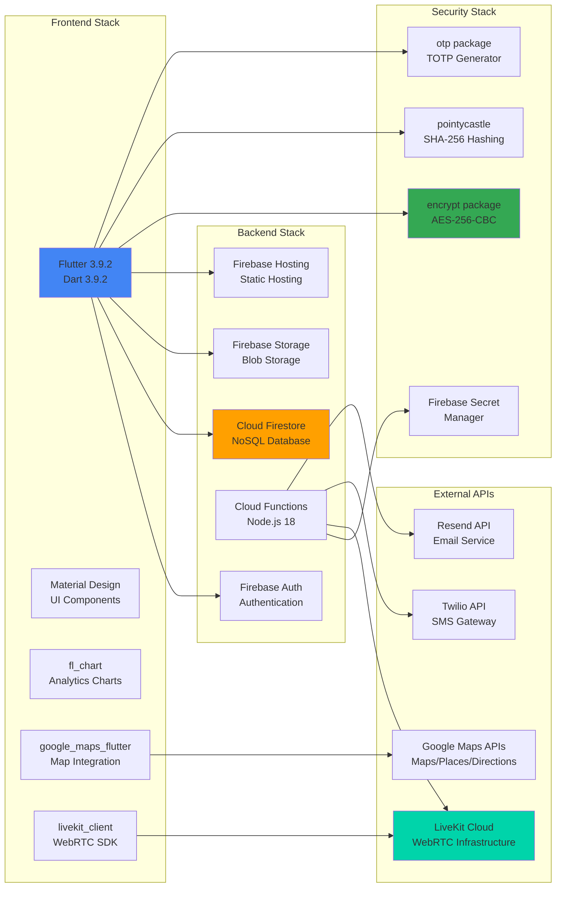

### Data Flow and Communication Patterns

```mermaid
graph TB
    subgraph "Real-time Data Flows"
        RT1[Emergency Alerts<br/>Real-time Sync]
        RT2[Location Updates<br/>GPS Streaming]
        RT3[Call Status<br/>WebRTC Signaling]
        RT4[Chat Messages<br/>Real-time Chat]
    end

    subgraph "Request-Response Flows"
        RR1[2FA Code Generation<br/>HTTP Callable]
        RR2[LiveKit Token<br/>HTTP Callable]
        RR3[Analytics Queries<br/>Firestore Queries]
        RR4[Facility Search<br/>Google Places API]
    end

    subgraph "Event-Driven Flows"
        ED1[Alert Created<br/>→ FCM Notification]
        ED2[Call Initiated<br/>→ Push Notification]
        ED3[Alert Accepted<br/>→ Update UI]
        ED4[Location Changed<br/>→ Update Map]
    end

    subgraph "Batch Operations"
        BO1[Analytics Aggregation<br/>7-day Trend]
        BO2[Top Dispatchers<br/>Ranking Query]
        BO3[Alert History<br/>Paginated List]
    end

    Firestore[(Firestore)] --> RT1
    Firestore --> RT2
    Firestore --> RT3
    Firestore --> RT4

    CloudFunc[Cloud Functions] --> RR1
    CloudFunc --> RR2
    Firestore --> RR3
    GoogleAPI[Google APIs] --> RR4

    FCM[FCM] --> ED1
    FCM --> ED2
    Firestore --> ED3
    GPS[GPS Service] --> ED4

    Firestore --> BO1
    Firestore --> BO2
    Firestore --> BO3

    style Firestore fill:#FFA000
    style CloudFunc fill:#FBBC04
    style FCM fill:#EA4335
    style GoogleAPI fill:#4285F4
```

---

## Use Case Diagram

### System Actors

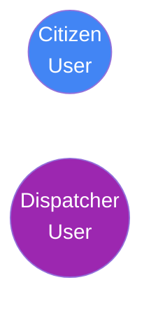

**Actor Descriptions:**
- **Citizen User**: End-user who creates emergency alerts and interacts with dispatchers
- **Dispatcher User**: Emergency response personnel who manage and respond to alerts

**Note:** System automated processes (encryption, notifications, token generation, etc.) are shown as dependencies using dotted lines in the diagrams below. They are not actors but rather internal system behaviors triggered by user actions.

---

### 1. Authentication & User Management Use Cases

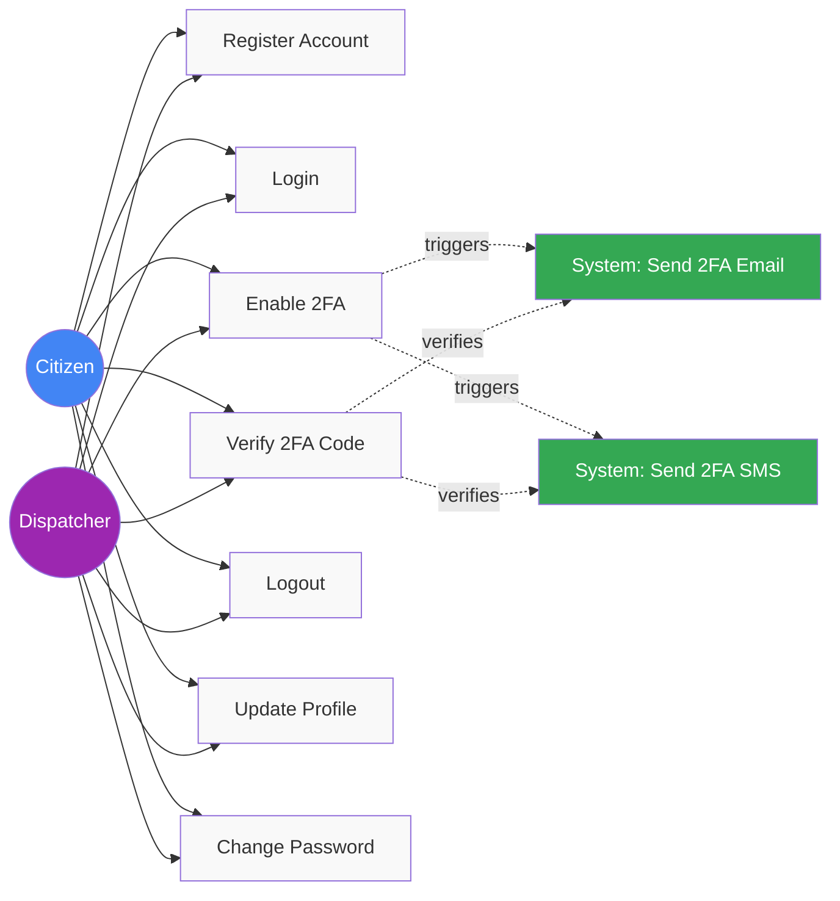

---

### 2. Citizen Emergency Alert Use Cases

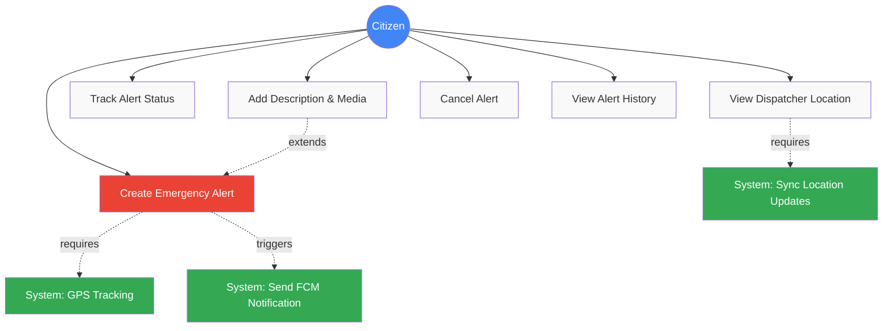

---

### 3. Citizen Medical Information Use Cases

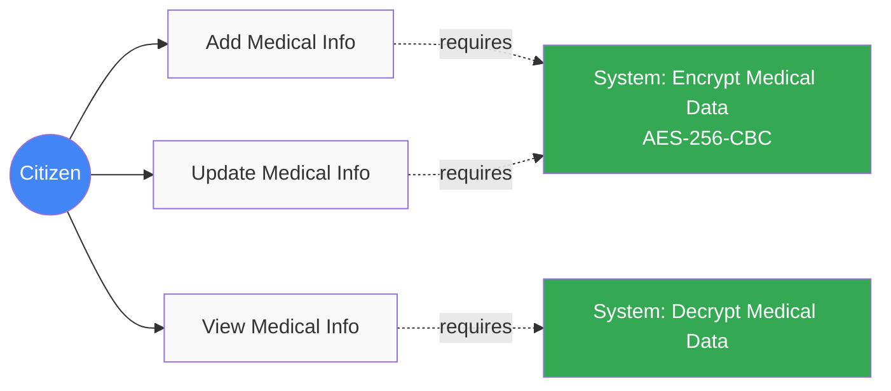

---

### 4. Citizen Location & Facility Use Cases

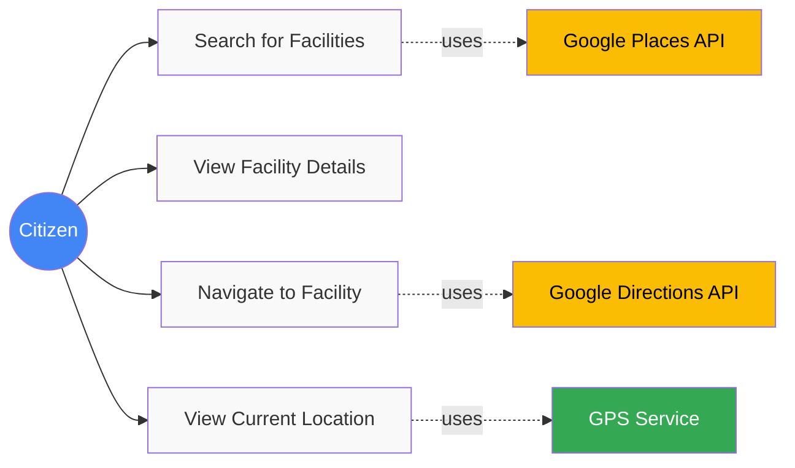

---

### 5. Dispatcher Alert Management Use Cases

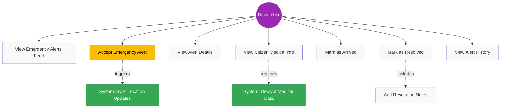

---

### 6. Dispatcher Analytics & Facility Management Use Cases

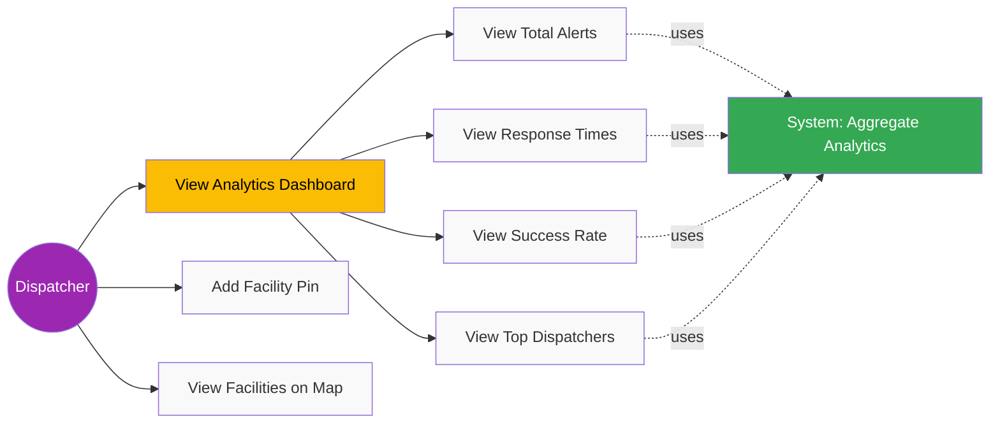

---

### 7. WebRTC Video/Audio Call Use Cases

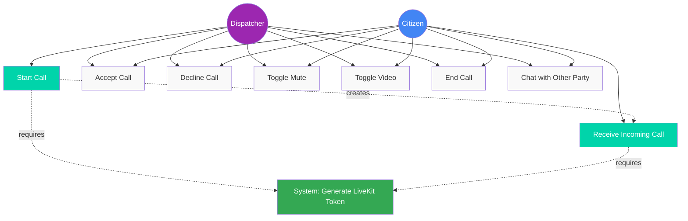

---

### Use Case Descriptions Table

| Use Case ID | Use Case Name | Actor | Description | Preconditions |
|-------------|---------------|-------|-------------|---------------|
| **UC1** | Register Account | Citizen, Dispatcher | Create new account with email, password, name, phone, role | None |
| **UC2** | Login | Citizen, Dispatcher | Authenticate with email and password | Account exists |
| **UC3** | Enable 2FA | Citizen, Dispatcher | Setup TOTP or email-based 2FA | Logged in |
| **UC4** | Verify 2FA Code | Citizen, Dispatcher | Enter 6-digit verification code | 2FA enabled, code sent |
| **UC5** | Logout | Citizen, Dispatcher | Sign out and clear session | Logged in |
| **UC6** | Create Emergency Alert | Citizen | Create SOS alert with location and services | Logged in, GPS enabled |
| **UC7** | Add Alert Description | Citizen | Add text description and upload media | Alert created |
| **UC8** | Track Alert Status | Citizen | Monitor alert status changes in real-time | Alert exists |
| **UC9** | Receive Call | Citizen | Accept/decline incoming call from dispatcher | Alert active, dispatcher calls |
| **UC10** | Chat with Dispatcher | Citizen | Send/receive real-time messages | Alert active |
| **UC11** | View Dispatcher Location | Citizen | Track dispatcher's GPS location on map | Alert accepted |
| **UC12** | Cancel Alert | Citizen | Cancel emergency alert before resolution | Alert pending/active |
| **UC13** | View Alert History | Citizen | Browse past emergency alerts | Logged in |
| **UC14** | Add Medical Info | Citizen | Enter medical information (encrypted) | Logged in |
| **UC15** | Update Medical Info | Citizen | Modify existing medical information | Medical info exists |
| **UC16** | View Medical Info | Citizen | View decrypted medical information | Medical info exists |
| **UC17** | Update Profile | Citizen, Dispatcher | Modify name, phone, email | Logged in |
| **UC18** | Change Password | Citizen, Dispatcher | Update account password | Logged in |
| **UC19** | Configure 2FA | Citizen, Dispatcher | Enable/disable 2FA, change method | Logged in |
| **UC20** | Search Facilities | Citizen | Find nearby hospitals, police, fire stations | GPS enabled |
| **UC21** | View Facility Details | Citizen | See facility address, phone, hours | Facility selected |
| **UC22** | Navigate to Facility | Citizen | Get directions to emergency facility | Facility selected, GPS enabled |
| **UC23** | View Current Location | Citizen | Display current GPS coordinates on map | GPS enabled |
| **UC24** | View Emergency Alerts | Dispatcher | See real-time feed of pending alerts | Logged in as dispatcher |
| **UC25** | Accept Alert | Dispatcher | Accept and assign alert to self | Alert pending |
| **UC26** | View Alert Details | Dispatcher | See alert location, services, media | Alert exists |
| **UC27** | View Citizen Medical Info | Dispatcher | Access encrypted medical information | Alert accepted |
| **UC28** | Initiate Call | Dispatcher | Start video/audio call to citizen | Alert accepted |
| **UC29** | Chat with Citizen | Dispatcher | Send/receive real-time messages | Alert active |
| **UC30** | Mark as Arrived | Dispatcher | Update status when arriving on scene | En route to site |
| **UC31** | Mark as Resolved | Dispatcher | Close alert with resolution notes | On-site, situation handled |
| **UC32** | View Alert History | Dispatcher | Browse all past alerts system-wide | Logged in as dispatcher |
| **UC33** | View Analytics Dashboard | Dispatcher | See metrics, charts, statistics | Logged in as dispatcher |
| **UC34** | View Total Alerts | Dispatcher | See alert count for time period | Analytics dashboard |
| **UC35** | View Response Times | Dispatcher | See average response time metrics | Analytics dashboard |
| **UC36** | View Success Rate | Dispatcher | See percentage of resolved alerts | Analytics dashboard |
| **UC37** | View Top Dispatchers | Dispatcher | See leaderboard of top performers | Analytics dashboard |
| **UC38** | Add Facility Pin | Dispatcher | Manually add emergency facility | Logged in as dispatcher |
| **UC39** | View Facilities on Map | Dispatcher | See all facilities on map | Logged in as dispatcher |
| **UC40** | Start Call | Dispatcher | Initiate video/audio call | Alert accepted |
| **UC41** | Accept Call | Citizen, Dispatcher | Accept incoming call | Call ringing |
| **UC42** | Decline Call | Citizen, Dispatcher | Reject incoming call | Call ringing |
| **UC43** | Toggle Mute | Citizen, Dispatcher | Mute/unmute microphone | In active call |
| **UC44** | Toggle Video | Citizen, Dispatcher | Enable/disable camera | In active call |
| **UC45** | End Call | Citizen, Dispatcher | Terminate active call | In active call |

**Total Use Cases:** 45 use cases across 7 functional areas

**Note:** System automated processes (encryption, notifications, token generation, location sync, analytics, security rules) are not separate use cases but rather internal system behaviors that support the user-facing use cases listed above. These are shown as dependencies in the diagrams with dotted lines.

---

## Complete WebRTC Call Flow

### End-to-End Call Sequence (Dispatcher → Citizen)

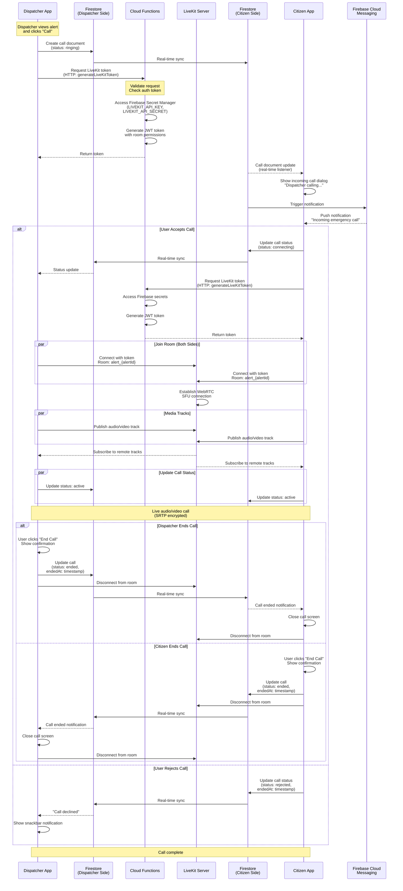

---

## Analytics Dashboard Data Flow

### Analytics Data Aggregation and Display

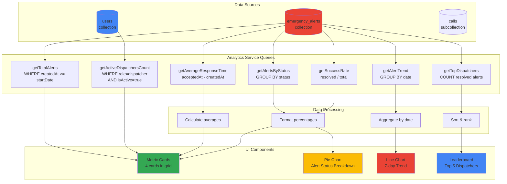

### Analytics Metrics Calculation

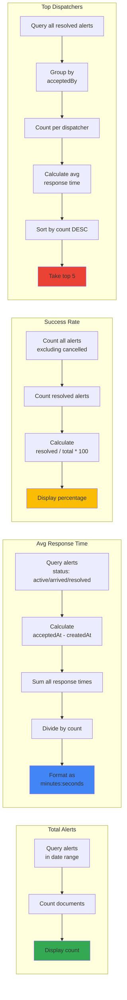

---

## Secrets Management Architecture

### Environment Variables and Secrets Flow

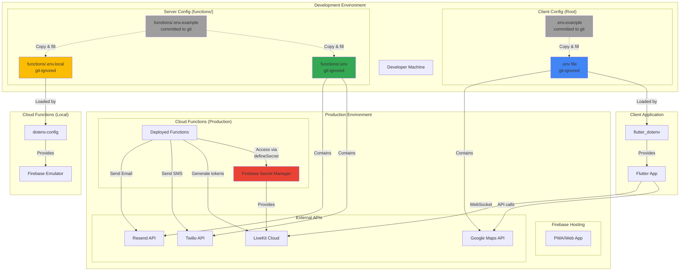

### Secret Categories and Storage

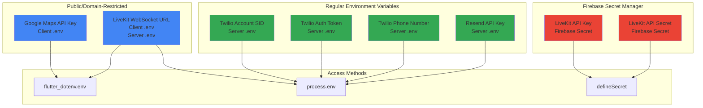

---

## Two-Factor Authentication Setup Flow

### TOTP (Authenticator App) Setup

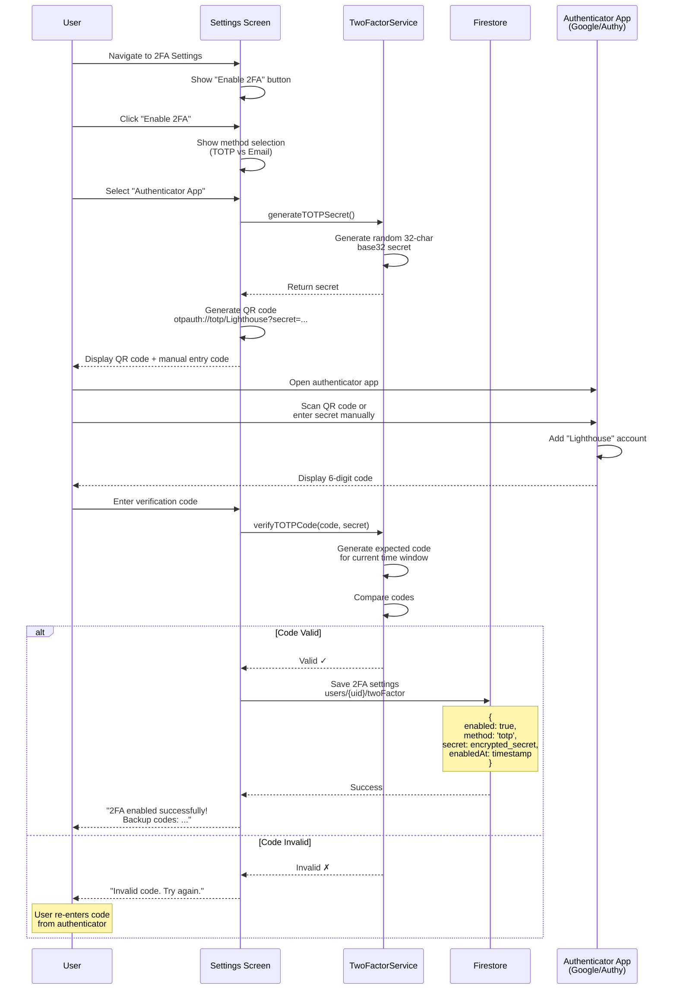

### Email-based 2FA Setup

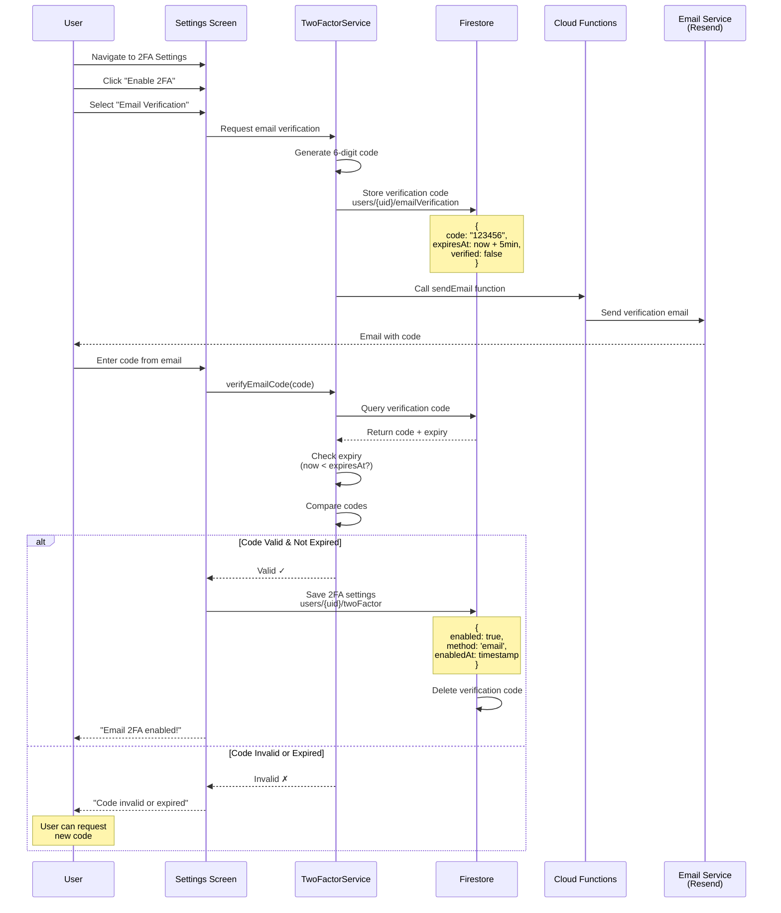

### 2FA Login Gate Flow

```mermaid
flowchart TB
    Start([User Logs In]) --> FirebaseAuth[Firebase Auth<br/>Email + Password]
    FirebaseAuth --> AuthSuccess{Auth<br/>Successful?}

    AuthSuccess -->|No| ShowError[Show Error Message]
    ShowError --> End1([End])

    AuthSuccess -->|Yes| Check2FA[Check Firestore<br/>users/{uid}/twoFactor]
    Check2FA --> Is2FAEnabled{2FA<br/>Enabled?}

    Is2FAEnabled -->|No| Dashboard[Navigate to Dashboard]
    Dashboard --> End2([End])

    Is2FAEnabled -->|Yes| Show2FAGate[Navigate to 2FA Gate<br/>Block dashboard access]
    Show2FAGate --> CheckMethod{2FA<br/>Method?}

    CheckMethod -->|TOTP| ShowTOTPInput[Show TOTP Input<br/>"Enter code from app"]
    CheckMethod -->|Email| SendEmailCode[Generate & Send<br/>Email Code]

    ShowTOTPInput --> EnterTOTP[User Enters Code]
    SendEmailCode --> ShowEmailInput[Show Email Input<br/>"Check your email"]
    ShowEmailInput --> EnterEmail[User Enters Code]

    EnterTOTP --> VerifyTOTP[Verify TOTP Code]
    EnterEmail --> VerifyEmail[Verify Email Code<br/>Check expiry]

    VerifyTOTP --> CodeValid{Code<br/>Valid?}
    VerifyEmail --> CodeValid

    CodeValid -->|No| ShowInvalidError[Show "Invalid Code"]
    ShowInvalidError --> CheckMethod

    CodeValid -->|Yes| CreateSession[Create 2FA Session<br/>users/{uid}/twoFactorSessions]
    CreateSession --> SessionDoc["{<br/>  sessionId: uuid,<br/>  verified: true,<br/>  createdAt: timestamp<br/>}"]
    SessionDoc --> Dashboard2[Navigate to Dashboard]
    Dashboard2 --> MonitorSession[Monitor Session<br/>Real-time Listener]

    MonitorSession --> SessionDeleted{Session<br/>Deleted?}
    SessionDeleted -->|Yes| SignOut[Force Sign Out<br/>Return to Login]
    SessionDeleted -->|No| MonitorSession

    SignOut --> End3([End])
    Dashboard2 --> End4([End])

    style FirebaseAuth fill:#4285F4
    style Show2FAGate fill:#EA4335
    style CreateSession fill:#34A853
    style Dashboard fill:#FBBC04
    style Dashboard2 fill:#FBBC04
```

---

## Component and Service Dependencies

### Flutter Widget Hierarchy

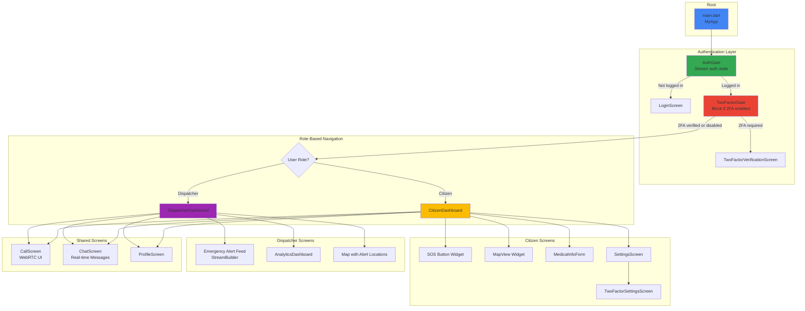

### Service Dependencies Graph

```mermaid
graph LR
    subgraph "Core Services"
        Auth[FirebaseAuth]
        Firestore[Cloud Firestore]
        Storage[Firebase Storage]
        FCM[Firebase Cloud<br/>Messaging]
    end

    subgraph "Application Services"
        TwoFactor[TwoFactorService]
        Encryption[EncryptionService]
        MedicalInfo[MedicalInfoService]
        Notification[NotificationService]
        LiveKit[LiveKitService]
        Places[PlacesService]
        Directions[DirectionsService]
        Analytics[AnalyticsService]
        AlertHistory[AlertHistoryService]
    end

    subgraph "External APIs"
        GMapsAPI[Google Maps API]
        PlacesAPI[Google Places API]
        DirectionsAPI[Google Directions API]
        LiveKitAPI[LiveKit Cloud]
        TwilioAPI[Twilio API]
        ResendAPI[Resend API]
    end

    TwoFactor --> Auth
    TwoFactor --> Firestore
    TwoFactor --> FCM

    Encryption --> Auth

    MedicalInfo --> Encryption
    MedicalInfo --> Firestore

    Notification --> FCM
    Notification --> Firestore

    LiveKit --> Firestore
    LiveKit --> LiveKitAPI

    Places --> PlacesAPI
    Places --> Firestore

    Directions --> DirectionsAPI

    Analytics --> Firestore

    AlertHistory --> Firestore

    style TwoFactor fill:#EA4335
    style Encryption fill:#34A853
    style MedicalInfo fill:#4285F4
    style LiveKit fill:#00D4AA
```

---

## Cloud Functions Architecture

### Firebase Cloud Functions Structure

```mermaid
graph TB
    subgraph "Client Requests"
        FlutterApp[Flutter App]
        WebApp[Web App]
    end

    subgraph "Firebase Cloud Functions"
        direction TB

        subgraph "LiveKit Functions"
            GenerateToken[generateLiveKitToken<br/>HTTP Callable]
            TokenLogic[Validate Request<br/>Access Secrets<br/>Generate JWT]
        end

        subgraph "Communication Functions"
            SendEmail[sendEmail<br/>HTTP Callable]
            SendSMS[sendSMS<br/>HTTP Callable]
            EmailLogic[Validate Request<br/>Send via Resend]
            SMSLogic[Validate Request<br/>Send via Twilio]
        end

        subgraph "2FA Functions"
            Verify2FA[verify2FACode<br/>HTTP Callable]
            TwoFALogic[Validate Code<br/>Check Expiry<br/>Update Session]
        end
    end

    subgraph "Secret Manager"
        LiveKitKey[LIVEKIT_API_KEY]
        LiveKitSecret[LIVEKIT_API_SECRET]
    end

    subgraph "Environment Variables"
        TwilioSID[TWILIO_ACCOUNT_SID]
        TwilioToken[TWILIO_AUTH_TOKEN]
        TwilioPhone[TWILIO_PHONE_NUMBER]
        ResendKey[RESEND_API_KEY]
    end

    subgraph "External Services"
        LiveKitCloud[LiveKit Cloud]
        TwilioAPI[Twilio API]
        ResendAPI[Resend API]
    end

    FlutterApp -->|HTTPS| GenerateToken
    WebApp -->|HTTPS| GenerateToken

    FlutterApp -->|HTTPS| SendEmail
    FlutterApp -->|HTTPS| SendSMS
    FlutterApp -->|HTTPS| Verify2FA

    GenerateToken --> TokenLogic
    TokenLogic --> LiveKitKey
    TokenLogic --> LiveKitSecret
    TokenLogic -->|Generate JWT| LiveKitCloud

    SendEmail --> EmailLogic
    EmailLogic --> ResendKey
    EmailLogic -->|API Call| ResendAPI

    SendSMS --> SMSLogic
    SMSLogic --> TwilioSID
    SMSLogic --> TwilioToken
    SMSLogic --> TwilioPhone
    SMSLogic -->|API Call| TwilioAPI

    Verify2FA --> TwoFALogic

    style GenerateToken fill:#00D4AA
    style SendEmail fill:#4285F4
    style SendSMS fill:#34A853
    style LiveKitKey fill:#EA4335
    style LiveKitSecret fill:#EA4335
```

### LiveKit Token Generation Flow

```mermaid
sequenceDiagram
    participant App as Flutter App
    participant CF as Cloud Function<br/>generateLiveKitToken
    participant SM as Firebase Secret<br/>Manager
    participant LK as LiveKit Cloud

    App->>CF: HTTP POST<br/>{alertId, userId}

    CF->>CF: Validate auth token<br/>Check user logged in

    CF->>SM: Access LIVEKIT_API_KEY
    SM-->>CF: Return API Key

    CF->>SM: Access LIVEKIT_API_SECRET
    SM-->>CF: Return API Secret

    CF->>CF: Generate JWT<br/>Room: alert_{alertId}<br/>Identity: user_{userId}<br/>Permissions: publish/subscribe

    Note over CF: JWT Payload:<br/>{<br/>  "sub": user_id,<br/>  "video": {<br/>    "room": "alert_123",<br/>    "roomJoin": true,<br/>    "canPublish": true,<br/>    "canSubscribe": true<br/>  }<br/>}

    CF-->>App: Return token

    App->>LK: Connect with token<br/>WebSocket URL + JWT
    LK->>LK: Validate JWT signature<br/>Check expiry
    LK-->>App: Connection established

    Note over App,LK: WebRTC media streaming
```

---

## SMS/Email Delivery Flow

### Two-Factor Code Delivery

```mermaid
flowchart TB
    Start([User Requests 2FA Code]) --> CheckMethod{Delivery<br/>Method?}

    subgraph "Email Flow"
        direction TB
        Email1[Generate Random<br/>6-digit Code]
        Email2[Store in Firestore<br/>users/{uid}/emailVerification]
        Email3[Call Cloud Function<br/>sendEmail]
        Email4[Cloud Function<br/>Accesses RESEND_API_KEY]
        Email5[Send via Resend API]
        Email6[Resend delivers email]
        Email7[User receives code]

        Email1 --> Email2
        Email2 --> Email3
        Email3 --> Email4
        Email4 --> Email5
        Email5 --> Email6
        Email6 --> Email7
    end

    subgraph "SMS Flow"
        direction TB
        SMS1[Generate Random<br/>6-digit Code]
        SMS2[Store in Firestore<br/>users/{uid}/smsVerification]
        SMS3[Call Cloud Function<br/>sendSMS]
        SMS4[Cloud Function<br/>Accesses Twilio Credentials]
        SMS5[Send via Twilio API]
        SMS6[Twilio delivers SMS]
        SMS7[User receives code]

        SMS1 --> SMS2
        SMS2 --> SMS3
        SMS3 --> SMS4
        SMS4 --> SMS5
        SMS5 --> SMS6
        SMS6 --> SMS7
    end

    CheckMethod -->|Email| Email1
    CheckMethod -->|SMS| SMS1

    Email7 --> Verify[User Enters Code]
    SMS7 --> Verify

    Verify --> Check[Verify Code<br/>Check Expiry]
    Check --> Valid{Valid &<br/>Not Expired?}

    Valid -->|Yes| Success[Verification Successful<br/>Delete Code]
    Valid -->|No| Error[Show Error<br/>Allow Retry]

    Success --> End1([End])
    Error --> End2([End])

    style Email1 fill:#4285F4
    style Email3 fill:#4285F4
    style SMS1 fill:#34A853
    style SMS3 fill:#34A853
    style Success fill:#FBBC04
```

### Email Template Structure

```mermaid
graph TB
    subgraph "Email Composition"
        Subject[Subject: Your Lighthouse<br/>Verification Code]

        subgraph "HTML Body"
            Header[Lighthouse Logo<br/>Emergency Response System]
            Message[You requested a verification<br/>code for 2FA]
            Code[6-Digit Code<br/>Large, Bold Font]
            Expiry[Code expires in 5 minutes]
            Warning[Do not share this code]
            Footer[Lighthouse Team<br/>Contact Info]
        end

        PlainText[Plain Text Fallback<br/>Same content, no HTML]
    end

    subgraph "Resend API Call"
        From[From: noreply@lighthouse.com]
        To[To: user@email.com]
        ReplyTo[Reply-To: support@lighthouse.com]
    end

    Subject --> From
    Header --> From
    Message --> From
    Code --> From
    Expiry --> From
    Warning --> From
    Footer --> From
    PlainText --> From

    From --> SendViaResend[Send via Resend API]
    To --> SendViaResend
    ReplyTo --> SendViaResend

    SendViaResend --> Delivered[Email Delivered]

    style Code fill:#EA4335
    style Expiry fill:#FBBC04
    style Delivered fill:#34A853
```

---

## Complete User Journey

### Citizen Emergency Flow (End-to-End)

```mermaid
flowchart TB
    Start([Citizen Opens App]) --> CheckAuth{Logged<br/>In?}

    CheckAuth -->|No| ShowLogin[Show Login Screen]
    ShowLogin --> EnterCreds[Enter Email + Password]
    EnterCreds --> FirebaseAuth[Firebase Authentication]

    CheckAuth -->|Yes| Check2FA
    FirebaseAuth --> Check2FA{2FA<br/>Enabled?}

    Check2FA -->|Yes| Show2FA[Show 2FA Verification]
    Show2FA --> Enter2FA[Enter TOTP/Email Code]
    Enter2FA --> Verify2FA[Verify Code]
    Verify2FA --> Valid2FA{Valid?}
    Valid2FA -->|No| Show2FA
    Valid2FA -->|Yes| Dashboard

    Check2FA -->|No| Dashboard[Show Citizen Dashboard]

    Dashboard --> ViewMap[View Map with<br/>Current Location]
    ViewMap --> Emergency{Emergency<br/>Situation?}

    Emergency -->|No| BrowseFeatures[Browse Features:<br/>- Medical Info<br/>- Settings<br/>- Facilities]
    BrowseFeatures --> End1([End])

    Emergency -->|Yes| PressSOSButton[Press SOS Button]
    PressSOSButton --> SelectServices[Select Emergency Services<br/>☑ Police<br/>☑ Ambulance<br/>☑ Fire]
    SelectServices --> AddDescription[Add Description<br/>Upload Photos/Videos]
    AddDescription --> ConfirmAlert[Confirm Emergency Alert]

    ConfirmAlert --> CreateAlert[Create Alert in Firestore<br/>Status: pending]
    CreateAlert --> NotifyDispatchers[FCM Notification to<br/>Available Dispatchers]

    NotifyDispatchers --> WaitAcceptance[Wait for Dispatcher<br/>to Accept]

    WaitAcceptance --> AlertAccepted{Dispatcher<br/>Accepts?}

    AlertAccepted -->|Timeout| ShowTimeout[No Dispatcher Available<br/>Try Again or Cancel]
    ShowTimeout --> End2([End])

    AlertAccepted -->|Yes| ShowAccepted[Show "Help is on the way!"<br/>Dispatcher Info<br/>Real-time Location]

    ShowAccepted --> ReceiveCall{Incoming<br/>Call?}

    ReceiveCall -->|Yes| ShowCallDialog[Show Call Dialog<br/>Accept / Decline]
    ShowCallDialog --> AcceptCall{Accept?}
    AcceptCall -->|Yes| JoinCall[Join LiveKit Room<br/>Start Video/Audio]
    AcceptCall -->|No| DeclineCall[Decline Call]

    JoinCall --> InCall[In Call with Dispatcher<br/>- Video/Audio<br/>- Mute/Unmute<br/>- Toggle Camera]
    InCall --> CallEnds{Call<br/>Ends?}
    CallEnds -->|Yes| ReturnToMap

    DeclineCall --> ReturnToMap[Return to Map View<br/>Track Dispatcher Location]
    ReceiveCall -->|No| ReturnToMap

    ReturnToMap --> DispatcherArrives{Dispatcher<br/>Arrives?}
    DispatcherArrives -->|No| ReturnToMap
    DispatcherArrives -->|Yes| ShowArrived[Show "Dispatcher Arrived"<br/>Status: arrived]

    ShowArrived --> Resolution[Emergency Handled<br/>On Site]
    Resolution --> DispatcherResolves[Dispatcher Marks Resolved<br/>Add Resolution Notes]

    DispatcherResolves --> ShowResolved[Show "Emergency Resolved"<br/>Thank You Message]
    ShowResolved --> ViewHistory[View Alert History]
    ViewHistory --> End3([End])

    style PressSOSButton fill:#EA4335
    style CreateAlert fill:#EA4335
    style ShowAccepted fill:#34A853
    style JoinCall fill:#00D4AA
    style ShowResolved fill:#4285F4
```

### Dispatcher Response Flow (End-to-End)

```mermaid
flowchart TB
    Start([Dispatcher Opens App]) --> CheckAuth{Logged<br/>In?}

    CheckAuth -->|No| ShowLogin[Show Login Screen]
    ShowLogin --> Login[Login with Credentials]
    Login --> Dashboard

    CheckAuth -->|Yes| Dashboard[Show Dispatcher Dashboard]

    Dashboard --> MonitorAlerts[Monitor Alert Feed<br/>Real-time StreamBuilder]

    MonitorAlerts --> NewAlert{New Alert<br/>Arrives?}

    NewAlert -->|No| MonitorAlerts
    NewAlert -->|Yes| PushNotif[Receive FCM Push<br/>Notification Sound]

    PushNotif --> ReviewAlert[Review Alert Details:<br/>- Location<br/>- Services Needed<br/>- Description<br/>- Photos/Videos]

    ReviewAlert --> DecideAction{Accept<br/>Alert?}

    DecideAction -->|No| DismissAlert[Dismiss Alert<br/>Continue Monitoring]
    DismissAlert --> MonitorAlerts

    DecideAction -->|Yes| AcceptAlert[Click "Accept Alert"]
    AcceptAlert --> UpdateFirestore[Update Firestore<br/>Status: active<br/>acceptedBy: dispatcher_id]

    UpdateFirestore --> ViewAlertMap[View Alert on Map<br/>Calculate Route<br/>Show Distance/ETA]

    ViewAlertMap --> InitiateCall{Need to<br/>Call Citizen?}

    InitiateCall -->|Yes| StartCall[Click "Call" Button]
    StartCall --> CreateCallDoc[Create Call Document<br/>Status: ringing]
    CreateCallDoc --> RequestToken[Request LiveKit Token<br/>from Cloud Function]
    RequestToken --> JoinRoom[Join LiveKit Room]

    JoinRoom --> WaitAnswer[Wait for Citizen<br/>to Answer]
    WaitAnswer --> Answered{Citizen<br/>Answers?}

    Answered -->|No| MissedCall[Call Declined/Missed<br/>Return to Map]
    Answered -->|Yes| ActiveCall[Active Video/Audio Call<br/>- Assess Situation<br/>- Provide Instructions<br/>- Gather Info]

    ActiveCall --> EndCall[End Call when Done]
    EndCall --> MissedCall

    InitiateCall -->|No| NavigateToSite
    MissedCall --> NavigateToSite[Navigate to Site<br/>Follow Google Maps Route]

    NavigateToSite --> Arrived{Arrived<br/>at Site?}

    Arrived -->|No| UpdateLocation[Update Real-time<br/>Location for Citizen]
    UpdateLocation --> NavigateToSite

    Arrived -->|Yes| MarkArrived[Click "I've Arrived"]
    MarkArrived --> UpdateStatus[Update Firestore<br/>Status: arrived<br/>arrivedAt: timestamp]

    UpdateStatus --> HandleEmergency[Handle Emergency<br/>On Site]

    HandleEmergency --> AccessMedical{Need Medical<br/>Info?}

    AccessMedical -->|Yes| ViewMedical[View Encrypted<br/>Medical Information<br/>- Blood Type<br/>- Allergies<br/>- Medications<br/>- Conditions]
    ViewMedical --> ResolveSituation

    AccessMedical -->|No| ResolveSituation[Resolve Emergency<br/>Situation]

    ResolveSituation --> MarkResolved[Click "Mark as Resolved"]
    MarkResolved --> AddNotes[Add Resolution Notes<br/>Document Actions Taken]

    AddNotes --> UpdateResolved[Update Firestore<br/>Status: resolved<br/>resolvedAt: timestamp<br/>resolutionNotes: text]

    UpdateResolved --> ViewAnalytics[View Analytics<br/>Dashboard Updates]

    ViewAnalytics --> End1([Return to Monitoring])
    End1 --> MonitorAlerts

    style AcceptAlert fill:#34A853
    style StartCall fill:#00D4AA
    style ActiveCall fill:#00D4AA
    style MarkArrived fill:#FBBC04
    style MarkResolved fill:#4285F4
```

---

## Performance and Optimization

### Data Caching Strategy

```mermaid
graph TB
    subgraph "Client App"
        UI[Flutter UI]

        subgraph "Cache Layers"
            Memory[In-Memory Cache<br/>Service-level State]
            LocalDB[Firestore Local<br/>Persistence Cache]
            ServiceWorker[Service Worker Cache<br/>PWA Assets]
        end
    end

    subgraph "Backend"
        Firestore[(Cloud Firestore)]
        Storage[(Firebase Storage)]
        CDN[Firebase CDN]
    end

    UI -->|Read| Memory
    Memory -->|Cache Miss| LocalDB
    LocalDB -->|Cache Miss| Firestore

    UI -->|Assets| ServiceWorker
    ServiceWorker -->|Cache Miss| CDN

    Firestore -->|Real-time Sync| LocalDB
    LocalDB -->|Update| Memory
    Memory -->|Rebuild| UI

    Storage --> CDN

    style Memory fill:#4285F4
    style LocalDB fill:#34A853
    style ServiceWorker fill:#FBBC04
```

### Real-time Update Optimization

```mermaid
flowchart LR
    subgraph "Firestore Updates"
        AlertCreate[Alert Created<br/>in Firestore]
        AlertUpdate[Alert Updated<br/>in Firestore]
    end

    subgraph "Client Listeners"
        Listener1[Citizen App<br/>StreamBuilder<br/>Query: userId == me]
        Listener2[Dispatcher App 1<br/>StreamBuilder<br/>Query: status == pending]
        Listener3[Dispatcher App 2<br/>StreamBuilder<br/>Query: status == pending]
    end

    subgraph "Optimization Techniques"
        IndexedQuery[Composite Index<br/>status + createdAt]
        Pagination[Limit to 20 results<br/>OrderBy timestamp DESC]
        Debounce[Debounced Marker Updates<br/>100ms delay]
    end

    AlertCreate --> IndexedQuery
    AlertUpdate --> IndexedQuery

    IndexedQuery --> Listener1
    IndexedQuery --> Listener2
    IndexedQuery --> Listener3

    Listener1 --> Pagination
    Listener2 --> Pagination
    Listener3 --> Pagination

    Pagination --> Debounce

    Debounce --> UIUpdate[Selective UI Rebuild<br/>Only affected widgets]

    style IndexedQuery fill:#EA4335
    style Pagination fill:#FBBC04
    style Debounce fill:#34A853
```

---

## Security Implementation

### Multi-Layer Security Model

```mermaid
graph TB
    subgraph "Layer 1: Network Security"
        HTTPS[HTTPS/TLS 1.3]
        WSS[WebSocket Secure<br/>wss://]
        SRTP[SRTP Encrypted Media]
    end

    subgraph "Layer 2: Authentication"
        FirebaseAuth[Firebase Auth<br/>Email + Password]
        TwoFA[Two-Factor Auth<br/>TOTP / Email]
        SessionMgmt[Session Management<br/>Real-time Monitoring]
    end

    subgraph "Layer 3: Authorization"
        RBAC[Role-Based Access<br/>Citizen / Dispatcher]
        SecurityRules[Firestore Rules<br/>User-specific Access]
        APIKeys[API Key Restrictions<br/>Domain/App-specific]
    end

    subgraph "Layer 4: Data Protection"
        AES256[AES-256-CBC<br/>Medical Data Encryption]
        KeyDerivation[SHA-256 Key<br/>Derived from UID]
        SecretManager[Firebase Secret Manager<br/>API Credentials]
    end

    subgraph "Layer 5: Input Validation"
        ClientValidation[Client-Side Validators<br/>Email, Phone, Password]
        ServerValidation[Firestore Rules<br/>Schema Validation]
        Sanitization[Input Sanitization<br/>XSS Prevention]
    end

    User[User Device] --> HTTPS
    HTTPS --> FirebaseAuth
    FirebaseAuth --> TwoFA
    TwoFA --> SessionMgmt

    SessionMgmt --> RBAC
    RBAC --> SecurityRules
    SecurityRules --> APIKeys

    APIKeys --> AES256
    AES256 --> KeyDerivation
    KeyDerivation --> SecretManager

    SecretManager --> ClientValidation
    ClientValidation --> ServerValidation
    ServerValidation --> Sanitization

    Sanitization --> DataAccess[(Secure Data Access)]

    WSS --> HTTPS
    SRTP --> WSS

    style HTTPS fill:#4285F4
    style TwoFA fill:#EA4335
    style AES256 fill:#34A853
    style SecurityRules fill:#FBBC04
```

---

## Conclusion

These comprehensive diagrams provide detailed visual documentation of the Lighthouse Emergency Response System's architecture, flows, and implementation details. They complement the main [ARCHITECTURE.md](ARCHITECTURE.md) document and serve as reference material for:

- ✅ **Development**: Understanding system interactions and dependencies
- ✅ **Debugging**: Tracing data flow and identifying bottlenecks
- ✅ **Documentation**: Academic project evaluation and presentation
- ✅ **Onboarding**: Helping new developers understand the system
- ✅ **Security Audits**: Visualizing security layers and data protection

---

**Last Updated:** December 29, 2025
**Version:** 1.0.0
**Created for:** Lighthouse Emergency Response System - Final Year Project
