# Lighthouse System - Comprehensive Diagrams

This document provides detailed visual diagrams for the Lighthouse Emergency Response System, complementing the architecture documentation in [ARCHITECTURE.md](ARCHITECTURE.md).

## Table of Contents
1. [System Design Diagram](#system-design-diagram)
2. [Use Case Diagram](#use-case-diagram)
3. [Complete WebRTC Call Flow](#complete-webrtc-call-flow)
4. [Analytics Dashboard Data Flow](#analytics-dashboard-data-flow)
5. [Secrets Management Architecture](#secrets-management-architecture)
6. [Two-Factor Authentication Setup Flow](#two-factor-authentication-setup-flow)
7. [Component and Service Dependencies](#component-and-service-dependencies)
8. [Cloud Functions Architecture](#cloud-functions-architecture)
9. [SMS/Email Delivery Flow](#smsemail-delivery-flow)
10. [Complete User Journey](#complete-user-journey)

---

## System Design Diagram

### Complete System Architecture Overview

```mermaid
graph TB
    subgraph "Client Platforms"
        subgraph "Mobile Apps"
            Android[Android App<br/>Flutter 3.9.2]
            iOS[iOS App<br/>Flutter 3.9.2]
        end

        subgraph "Web & Desktop"
            PWA[Progressive Web App<br/>Flutter Web]
            Desktop[Desktop Apps<br/>Windows/macOS/Linux]
        end
    end

    subgraph "Presentation Layer - Flutter"
        subgraph "Citizen UI"
            CitizenDash[Citizen Dashboard<br/>- SOS Button<br/>- Map View<br/>- Medical Info]
            CitizenScreens[Screens:<br/>- Profile<br/>- Settings<br/>- 2FA Setup<br/>- Alert History]
        end

        subgraph "Dispatcher UI"
            DispatcherDash[Dispatcher Dashboard<br/>- Alert Feed<br/>- Analytics<br/>- Map View]
            DispatcherScreens[Screens:<br/>- Profile<br/>- Settings<br/>- Facility Management]
        end

        subgraph "Shared UI"
            CallScreen[Call Screen<br/>Video/Audio UI]
            ChatScreen[Chat Screen<br/>Real-time Messages]
            AuthScreens[Auth Screens:<br/>- Login<br/>- 2FA Gate<br/>- 2FA Verify]
        end
    end

    subgraph "Business Logic Layer - Services"
        subgraph "Core Services"
            TwoFactorSvc[TwoFactorService<br/>TOTP + Email 2FA]
            EncryptionSvc[EncryptionService<br/>AES-256-CBC]
            MedicalInfoSvc[MedicalInfoService<br/>Encrypted CRUD]
        end

        subgraph "Communication Services"
            LiveKitSvc[LiveKitService<br/>WebRTC Calls]
            NotificationSvc[NotificationService<br/>FCM Push]
        end

        subgraph "Location Services"
            PlacesSvc[PlacesService<br/>Facility Search]
            DirectionsSvc[DirectionsService<br/>Route Calculation]
        end

        subgraph "Data Services"
            AnalyticsSvc[AnalyticsService<br/>Metrics Aggregation]
            AlertHistorySvc[AlertHistoryService<br/>Alert CRUD]
        end
    end

    subgraph "Data Models Layer"
        Models[Data Models:<br/>- EmergencyAlert<br/>- MedicalInfo<br/>- Call<br/>- ChatMessage<br/>- FacilityPin]
    end

    subgraph "Firebase Backend"
        subgraph "Authentication & Authorization"
            FirebaseAuth[Firebase Authentication<br/>Email/Password<br/>JWT Tokens]
        end

        subgraph "Data Storage"
            Firestore[(Cloud Firestore<br/>NoSQL Database<br/>Real-time Sync)]
            FirebaseStorage[(Firebase Storage<br/>Media Files<br/>Photos/Videos)]
        end

        subgraph "Serverless Computing"
            CloudFunctions[Cloud Functions<br/>Node.js Runtime]

            subgraph "Function Endpoints"
                TokenFunc[generateLiveKitToken<br/>JWT Generation]
                EmailFunc[sendEmail<br/>Resend API]
                SMSFunc[sendSMS<br/>Twilio API]
            end
        end

        subgraph "Messaging & Secrets"
            FCM[Firebase Cloud<br/>Messaging<br/>Push Notifications]
            SecretManager[Firebase Secret<br/>Manager<br/>API Credentials]
        end
    end

    subgraph "External Services"
        subgraph "Real-time Communication"
            LiveKitCloud[LiveKit Cloud<br/>WebRTC SFU Server<br/>Media Relay]
        end

        subgraph "Location & Maps"
            GoogleMaps[Google Maps API<br/>Map Rendering]
            GooglePlaces[Google Places API<br/>Facility Search]
            GoogleDirections[Google Directions API<br/>Route Calculation]
        end

        subgraph "Communication APIs"
            Twilio[Twilio API<br/>SMS Delivery]
            Resend[Resend API<br/>Email Delivery]
        end
    end

    subgraph "Infrastructure"
        subgraph "Hosting & CDN"
            FirebaseHosting[Firebase Hosting<br/>Global CDN<br/>SSL/TLS]
            ServiceWorker[Service Worker<br/>Offline Support<br/>PWA Cache]
        end

        subgraph "Security"
            HTTPS[HTTPS/TLS 1.3<br/>All Communications]
            SRTP[SRTP<br/>Encrypted Media]
            SecurityRules[Firestore Security Rules<br/>RBAC]
        end
    end

    %% Client to Presentation
    Android --> CitizenDash
    iOS --> CitizenDash
    PWA --> CitizenDash
    PWA --> DispatcherDash
    Desktop --> DispatcherDash

    %% Presentation to Business Logic
    CitizenDash --> TwoFactorSvc
    CitizenDash --> MedicalInfoSvc
    CitizenDash --> PlacesSvc
    CitizenDash --> DirectionsSvc
    CitizenDash --> AlertHistorySvc

    DispatcherDash --> AnalyticsSvc
    DispatcherDash --> AlertHistorySvc
    DispatcherDash --> PlacesSvc

    CallScreen --> LiveKitSvc
    ChatScreen --> NotificationSvc
    AuthScreens --> TwoFactorSvc

    %% Business Logic to Data Models
    TwoFactorSvc --> Models
    MedicalInfoSvc --> Models
    LiveKitSvc --> Models
    AnalyticsSvc --> Models
    AlertHistorySvc --> Models

    %% Business Logic to Backend
    TwoFactorSvc --> FirebaseAuth
    TwoFactorSvc --> Firestore
    TwoFactorSvc --> CloudFunctions

    EncryptionSvc --> FirebaseAuth
    MedicalInfoSvc --> EncryptionSvc
    MedicalInfoSvc --> Firestore

    LiveKitSvc --> Firestore
    LiveKitSvc --> CloudFunctions
    NotificationSvc --> FCM
    NotificationSvc --> Firestore

    AnalyticsSvc --> Firestore
    AlertHistorySvc --> Firestore
    AlertHistorySvc --> FirebaseStorage

    %% Cloud Functions to Secrets
    TokenFunc --> SecretManager
    EmailFunc --> SecretManager
    SMSFunc --> SecretManager

    CloudFunctions --> TokenFunc
    CloudFunctions --> EmailFunc
    CloudFunctions --> SMSFunc

    %% Cloud Functions to External APIs
    TokenFunc --> LiveKitCloud
    EmailFunc --> Resend
    SMSFunc --> Twilio

    %% Services to External APIs
    LiveKitSvc --> LiveKitCloud
    PlacesSvc --> GooglePlaces
    DirectionsSvc --> GoogleDirections
    CitizenDash --> GoogleMaps
    DispatcherDash --> GoogleMaps

    %% Hosting
    PWA --> FirebaseHosting
    FirebaseHosting --> ServiceWorker

    %% Security Layer
    HTTPS --> FirebaseAuth
    HTTPS --> Firestore
    HTTPS --> CloudFunctions
    SRTP --> LiveKitCloud
    SecurityRules --> Firestore

    %% Styling
    style Android fill:#3DDC84
    style iOS fill:#007AFF
    style PWA fill:#4285F4
    style Firestore fill:#FFA000
    style LiveKitCloud fill:#00D4AA
    style SecretManager fill:#EA4335
    style EncryptionSvc fill:#34A853
    style TwoFactorSvc fill:#EA4335
    style AnalyticsSvc fill:#FBBC04
```

### System Technology Stack Breakdown

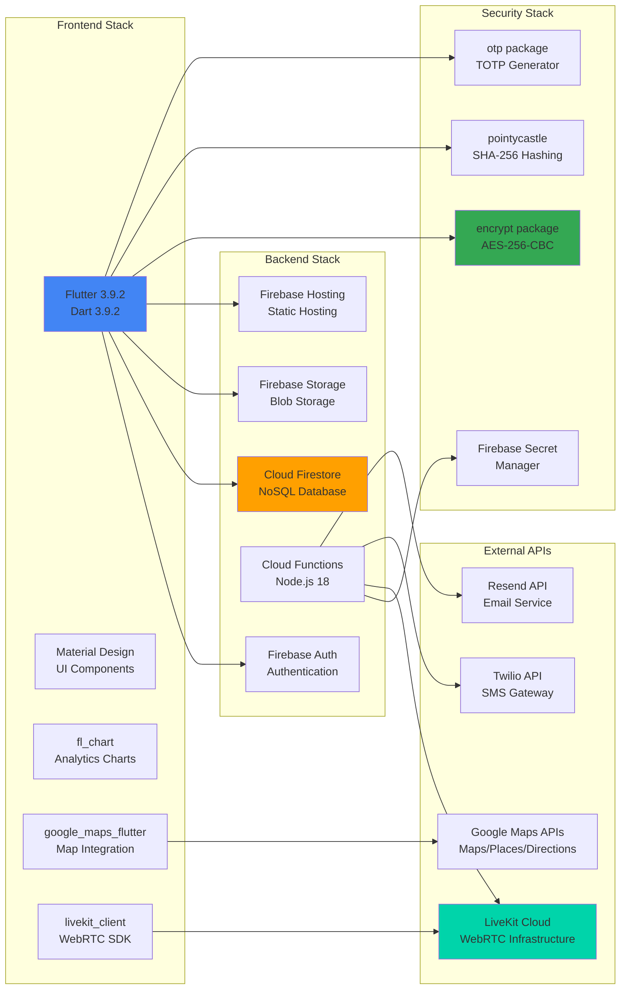

### Data Flow and Communication Patterns

```mermaid
graph TB
    subgraph "Real-time Data Flows"
        RT1[Emergency Alerts<br/>Real-time Sync]
        RT2[Location Updates<br/>GPS Streaming]
        RT3[Call Status<br/>WebRTC Signaling]
        RT4[Chat Messages<br/>Real-time Chat]
    end

    subgraph "Request-Response Flows"
        RR1[2FA Code Generation<br/>HTTP Callable]
        RR2[LiveKit Token<br/>HTTP Callable]
        RR3[Analytics Queries<br/>Firestore Queries]
        RR4[Facility Search<br/>Google Places API]
    end

    subgraph "Event-Driven Flows"
        ED1[Alert Created<br/>→ FCM Notification]
        ED2[Call Initiated<br/>→ Push Notification]
        ED3[Alert Accepted<br/>→ Update UI]
        ED4[Location Changed<br/>→ Update Map]
    end

    subgraph "Batch Operations"
        BO1[Analytics Aggregation<br/>7-day Trend]
        BO2[Top Dispatchers<br/>Ranking Query]
        BO3[Alert History<br/>Paginated List]
    end

    Firestore[(Firestore)] --> RT1
    Firestore --> RT2
    Firestore --> RT3
    Firestore --> RT4

    CloudFunc[Cloud Functions] --> RR1
    CloudFunc --> RR2
    Firestore --> RR3
    GoogleAPI[Google APIs] --> RR4

    FCM[FCM] --> ED1
    FCM --> ED2
    Firestore --> ED3
    GPS[GPS Service] --> ED4

    Firestore --> BO1
    Firestore --> BO2
    Firestore --> BO3

    style Firestore fill:#FFA000
    style CloudFunc fill:#FBBC04
    style FCM fill:#EA4335
    style GoogleAPI fill:#4285F4
```

---

## Use Case Diagram

### Complete System Use Case Diagram

```mermaid
graph TB
    %% Actors
    Citizen((Citizen<br/>User))
    Dispatcher((Dispatcher<br/>User))

    %% Authentication & User Management
    subgraph AUTH["Authentication & User Management"]
        UC1[Register Account]
        UC2[Login]
        UC3[Enable 2FA]
        UC4[Verify 2FA Code]
        UC5[Logout]
        UC17[Update Profile]
        UC18[Change Password]
    end

    %% Citizen Emergency
    subgraph EMERGENCY["Emergency Alert Management"]
        UC6[Create Emergency Alert]
        UC7[Add Description & Media]
        UC8[Track Alert Status]
        UC11[View Dispatcher Location]
        UC12[Cancel Alert]
        UC13[View Alert History - Citizen]
    end

    %% Medical Info
    subgraph MEDICAL["Medical Information"]
        UC14[Add Medical Info]
        UC15[Update Medical Info]
        UC16[View Medical Info]
    end

    %% Location & Facilities
    subgraph LOCATION["Location & Facilities"]
        UC20[Search Facilities]
        UC21[View Facility Details]
        UC22[Navigate to Facility]
        UC23[View Current Location]
    end

    %% Dispatcher Alert Management
    subgraph DISPATCH["Dispatcher Alert Response"]
        UC24[View Emergency Alerts Feed]
        UC25[Accept Emergency Alert]
        UC26[View Alert Details]
        UC27[View Citizen Medical Info]
        UC30[Mark as Arrived]
        UC31[Mark as Resolved]
        UC32[View Alert History - All]
    end

    %% Analytics
    subgraph ANALYTICS["Analytics & Reporting"]
        UC33[View Analytics Dashboard]
        UC34[View Total Alerts]
        UC35[View Response Times]
        UC36[View Success Rate]
        UC37[View Top Dispatchers]
        UC38[Add Facility Pin]
        UC39[View Facilities on Map]
    end

    %% Calls & Communication
    subgraph CALLS["Video/Audio Calls"]
        UC9[Receive Incoming Call]
        UC10[Chat Messages]
        UC40[Start Call]
        UC41[Accept Call]
        UC42[Decline Call]
        UC43[Toggle Mute]
        UC44[Toggle Video]
        UC45[End Call]
    end

    %% Citizen connections
    Citizen --> UC1
    Citizen --> UC2
    Citizen --> UC3
    Citizen --> UC4
    Citizen --> UC5
    Citizen --> UC17
    Citizen --> UC18

    Citizen --> UC6
    Citizen --> UC7
    Citizen --> UC8
    Citizen --> UC11
    Citizen --> UC12
    Citizen --> UC13

    Citizen --> UC14
    Citizen --> UC15
    Citizen --> UC16

    Citizen --> UC20
    Citizen --> UC21
    Citizen --> UC22
    Citizen --> UC23

    Citizen --> UC9
    Citizen --> UC10
    Citizen --> UC41
    Citizen --> UC42
    Citizen --> UC43
    Citizen --> UC44
    Citizen --> UC45

    %% Dispatcher connections
    Dispatcher --> UC1
    Dispatcher --> UC2
    Dispatcher --> UC3
    Dispatcher --> UC4
    Dispatcher --> UC5
    Dispatcher --> UC17
    Dispatcher --> UC18

    Dispatcher --> UC24
    Dispatcher --> UC25
    Dispatcher --> UC26
    Dispatcher --> UC27
    Dispatcher --> UC30
    Dispatcher --> UC31
    Dispatcher --> UC32

    Dispatcher --> UC33
    Dispatcher --> UC34
    Dispatcher --> UC35
    Dispatcher --> UC36
    Dispatcher --> UC37
    Dispatcher --> UC38
    Dispatcher --> UC39

    Dispatcher --> UC10
    Dispatcher --> UC40
    Dispatcher --> UC41
    Dispatcher --> UC42
    Dispatcher --> UC43
    Dispatcher --> UC44
    Dispatcher --> UC45

    %% Styling
    style Citizen fill:#4285F4,color:#fff,stroke:#1967D2,stroke-width:3px
    style Dispatcher fill:#9C27B0,color:#fff,stroke:#7B1FA2,stroke-width:3px

    style AUTH fill:#E8F0FE,stroke:#1967D2,stroke-width:2px
    style EMERGENCY fill:#FCE8E6,stroke:#EA4335,stroke-width:2px
    style MEDICAL fill:#E6F4EA,stroke:#34A853,stroke-width:2px
    style LOCATION fill:#FEF7E0,stroke:#FBBC04,stroke-width:2px
    style DISPATCH fill:#F3E8FD,stroke:#9C27B0,stroke-width:2px
    style ANALYTICS fill:#FEF7E0,stroke:#FBBC04,stroke-width:2px
    style CALLS fill:#E0F2F1,stroke:#00897B,stroke-width:2px
```

**Actor Descriptions:**
- **Citizen User**: End-user who creates emergency alerts and interacts with dispatchers
- **Dispatcher User**: Emergency response personnel who manage and respond to alerts

**Use Case Groups:**
1. **Authentication & User Management** (7 use cases) - Login, registration, 2FA, profile management
2. **Emergency Alert Management** (6 use cases) - Citizen emergency alert creation and tracking
3. **Medical Information** (3 use cases) - Encrypted medical data management
4. **Location & Facilities** (4 use cases) - GPS tracking and facility search
5. **Dispatcher Alert Response** (7 use cases) - Alert acceptance and resolution
6. **Analytics & Reporting** (7 use cases) - Metrics, dashboards, and facility management
7. **Video/Audio Calls** (8 use cases) - WebRTC communication between parties

**Total Use Cases:** 45

---

### Use Case Descriptions Table

| Use Case ID | Use Case Name | Actor | Description | Preconditions |
|-------------|---------------|-------|-------------|---------------|
| **UC1** | Register Account | Citizen, Dispatcher | Create new account with email, password, name, phone, role | None |
| **UC2** | Login | Citizen, Dispatcher | Authenticate with email and password | Account exists |
| **UC3** | Enable 2FA | Citizen, Dispatcher | Setup TOTP or email-based 2FA | Logged in |
| **UC4** | Verify 2FA Code | Citizen, Dispatcher | Enter 6-digit verification code | 2FA enabled, code sent |
| **UC5** | Logout | Citizen, Dispatcher | Sign out and clear session | Logged in |
| **UC6** | Create Emergency Alert | Citizen | Create SOS alert with location and services | Logged in, GPS enabled |
| **UC7** | Add Alert Description | Citizen | Add text description and upload media | Alert created |
| **UC8** | Track Alert Status | Citizen | Monitor alert status changes in real-time | Alert exists |
| **UC9** | Receive Call | Citizen | Accept/decline incoming call from dispatcher | Alert active, dispatcher calls |
| **UC10** | Chat with Dispatcher | Citizen | Send/receive real-time messages | Alert active |
| **UC11** | View Dispatcher Location | Citizen | Track dispatcher's GPS location on map | Alert accepted |
| **UC12** | Cancel Alert | Citizen | Cancel emergency alert before resolution | Alert pending/active |
| **UC13** | View Alert History | Citizen | Browse past emergency alerts | Logged in |
| **UC14** | Add Medical Info | Citizen | Enter medical information (encrypted) | Logged in |
| **UC15** | Update Medical Info | Citizen | Modify existing medical information | Medical info exists |
| **UC16** | View Medical Info | Citizen | View decrypted medical information | Medical info exists |
| **UC17** | Update Profile | Citizen, Dispatcher | Modify name, phone, email | Logged in |
| **UC18** | Change Password | Citizen, Dispatcher | Update account password | Logged in |
| **UC19** | Configure 2FA | Citizen, Dispatcher | Enable/disable 2FA, change method | Logged in |
| **UC20** | Search Facilities | Citizen | Find nearby hospitals, police, fire stations | GPS enabled |
| **UC21** | View Facility Details | Citizen | See facility address, phone, hours | Facility selected |
| **UC22** | Navigate to Facility | Citizen | Get directions to emergency facility | Facility selected, GPS enabled |
| **UC23** | View Current Location | Citizen | Display current GPS coordinates on map | GPS enabled |
| **UC24** | View Emergency Alerts | Dispatcher | See real-time feed of pending alerts | Logged in as dispatcher |
| **UC25** | Accept Alert | Dispatcher | Accept and assign alert to self | Alert pending |
| **UC26** | View Alert Details | Dispatcher | See alert location, services, media | Alert exists |
| **UC27** | View Citizen Medical Info | Dispatcher | Access encrypted medical information | Alert accepted |
| **UC28** | Initiate Call | Dispatcher | Start video/audio call to citizen | Alert accepted |
| **UC29** | Chat with Citizen | Dispatcher | Send/receive real-time messages | Alert active |
| **UC30** | Mark as Arrived | Dispatcher | Update status when arriving on scene | En route to site |
| **UC31** | Mark as Resolved | Dispatcher | Close alert with resolution notes | On-site, situation handled |
| **UC32** | View Alert History | Dispatcher | Browse all past alerts system-wide | Logged in as dispatcher |
| **UC33** | View Analytics Dashboard | Dispatcher | See metrics, charts, statistics | Logged in as dispatcher |
| **UC34** | View Total Alerts | Dispatcher | See alert count for time period | Analytics dashboard |
| **UC35** | View Response Times | Dispatcher | See average response time metrics | Analytics dashboard |
| **UC36** | View Success Rate | Dispatcher | See percentage of resolved alerts | Analytics dashboard |
| **UC37** | View Top Dispatchers | Dispatcher | See leaderboard of top performers | Analytics dashboard |
| **UC38** | Add Facility Pin | Dispatcher | Manually add emergency facility | Logged in as dispatcher |
| **UC39** | View Facilities on Map | Dispatcher | See all facilities on map | Logged in as dispatcher |
| **UC40** | Start Call | Dispatcher | Initiate video/audio call | Alert accepted |
| **UC41** | Accept Call | Citizen, Dispatcher | Accept incoming call | Call ringing |
| **UC42** | Decline Call | Citizen, Dispatcher | Reject incoming call | Call ringing |
| **UC43** | Toggle Mute | Citizen, Dispatcher | Mute/unmute microphone | In active call |
| **UC44** | Toggle Video | Citizen, Dispatcher | Enable/disable camera | In active call |
| **UC45** | End Call | Citizen, Dispatcher | Terminate active call | In active call |

**Total Use Cases:** 45 use cases across 7 functional areas

**Note:** System automated processes (encryption, notifications, token generation, location sync, analytics, security rules) are not separate use cases but rather internal system behaviors that support the user-facing use cases listed above. These are shown as dependencies in the diagrams with dotted lines.

---

## Complete WebRTC Call Flow

### End-to-End Call Sequence (Dispatcher → Citizen)

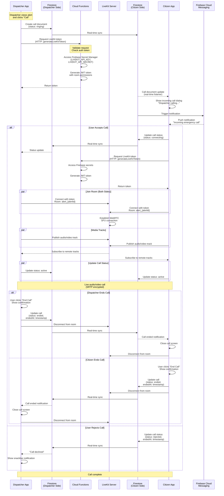

---

## Analytics Dashboard Data Flow

### Analytics Data Aggregation and Display

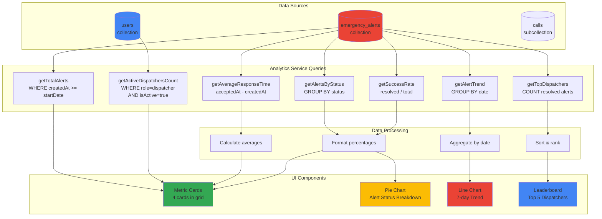

### Analytics Metrics Calculation

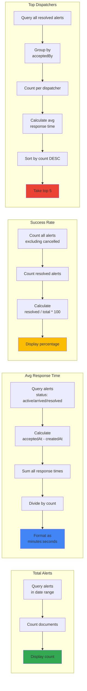

---

## Secrets Management Architecture

### Environment Variables and Secrets Flow

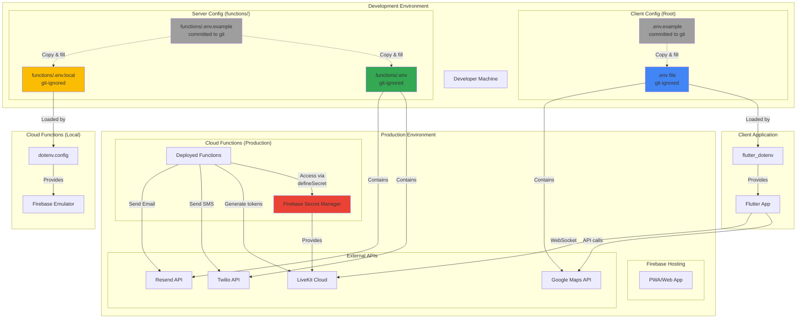

### Secret Categories and Storage

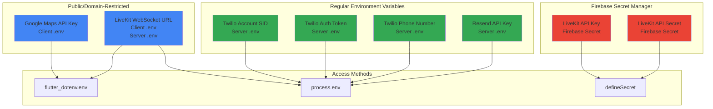

---

## Two-Factor Authentication Setup Flow

### TOTP (Authenticator App) Setup

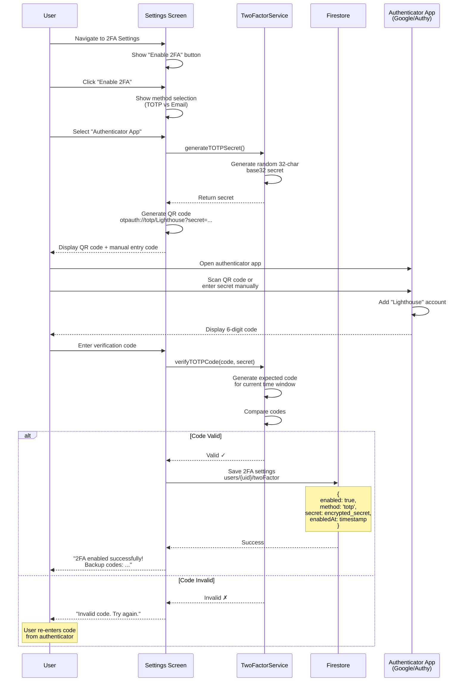

### Email-based 2FA Setup

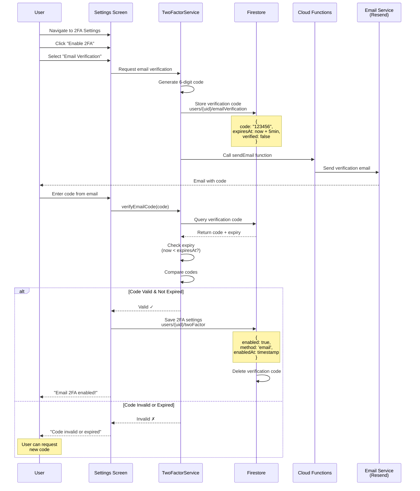

### 2FA Login Gate Flow

```mermaid
flowchart TB
    Start([User Logs In]) --> FirebaseAuth[Firebase Auth<br/>Email + Password]
    FirebaseAuth --> AuthSuccess{Auth<br/>Successful?}

    AuthSuccess -->|No| ShowError[Show Error Message]
    ShowError --> End1([End])

    AuthSuccess -->|Yes| Check2FA[Check Firestore<br/>users/{uid}/twoFactor]
    Check2FA --> Is2FAEnabled{2FA<br/>Enabled?}

    Is2FAEnabled -->|No| Dashboard[Navigate to Dashboard]
    Dashboard --> End2([End])

    Is2FAEnabled -->|Yes| Show2FAGate[Navigate to 2FA Gate<br/>Block dashboard access]
    Show2FAGate --> CheckMethod{2FA<br/>Method?}

    CheckMethod -->|TOTP| ShowTOTPInput[Show TOTP Input<br/>"Enter code from app"]
    CheckMethod -->|Email| SendEmailCode[Generate & Send<br/>Email Code]

    ShowTOTPInput --> EnterTOTP[User Enters Code]
    SendEmailCode --> ShowEmailInput[Show Email Input<br/>"Check your email"]
    ShowEmailInput --> EnterEmail[User Enters Code]

    EnterTOTP --> VerifyTOTP[Verify TOTP Code]
    EnterEmail --> VerifyEmail[Verify Email Code<br/>Check expiry]

    VerifyTOTP --> CodeValid{Code<br/>Valid?}
    VerifyEmail --> CodeValid

    CodeValid -->|No| ShowInvalidError[Show "Invalid Code"]
    ShowInvalidError --> CheckMethod

    CodeValid -->|Yes| CreateSession[Create 2FA Session<br/>users/{uid}/twoFactorSessions]
    CreateSession --> SessionDoc["{<br/>  sessionId: uuid,<br/>  verified: true,<br/>  createdAt: timestamp<br/>}"]
    SessionDoc --> Dashboard2[Navigate to Dashboard]
    Dashboard2 --> MonitorSession[Monitor Session<br/>Real-time Listener]

    MonitorSession --> SessionDeleted{Session<br/>Deleted?}
    SessionDeleted -->|Yes| SignOut[Force Sign Out<br/>Return to Login]
    SessionDeleted -->|No| MonitorSession

    SignOut --> End3([End])
    Dashboard2 --> End4([End])

    style FirebaseAuth fill:#4285F4
    style Show2FAGate fill:#EA4335
    style CreateSession fill:#34A853
    style Dashboard fill:#FBBC04
    style Dashboard2 fill:#FBBC04
```

---

## Component and Service Dependencies

### Flutter Widget Hierarchy

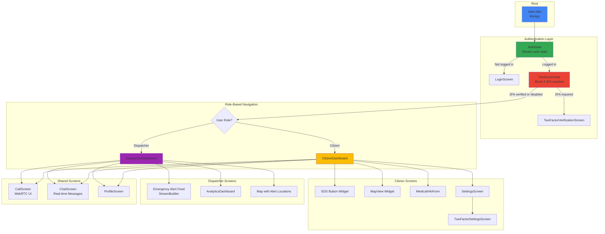

### Service Dependencies Graph

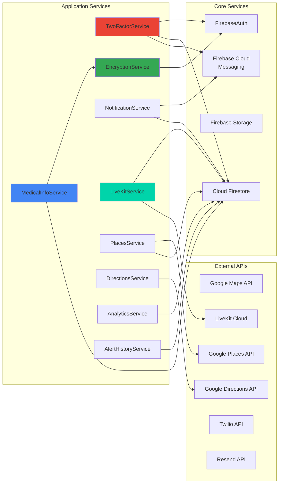

---

## Cloud Functions Architecture

### Firebase Cloud Functions Structure

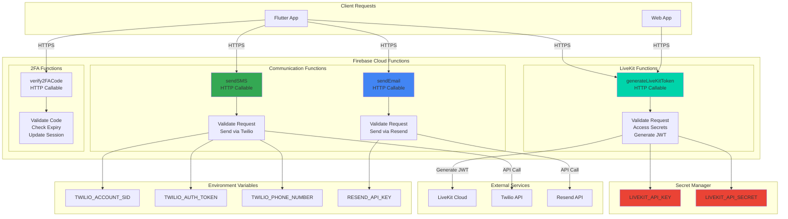

### LiveKit Token Generation Flow

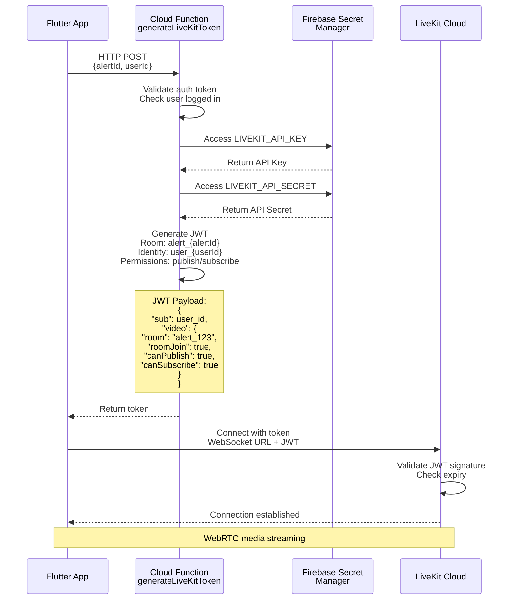

---

## SMS/Email Delivery Flow

### Two-Factor Code Delivery

```mermaid
flowchart TB
    Start([User Requests 2FA Code]) --> CheckMethod{Delivery<br/>Method?}

    subgraph "Email Flow"
        direction TB
        Email1[Generate Random<br/>6-digit Code]
        Email2[Store in Firestore<br/>users/{uid}/emailVerification]
        Email3[Call Cloud Function<br/>sendEmail]
        Email4[Cloud Function<br/>Accesses RESEND_API_KEY]
        Email5[Send via Resend API]
        Email6[Resend delivers email]
        Email7[User receives code]

        Email1 --> Email2
        Email2 --> Email3
        Email3 --> Email4
        Email4 --> Email5
        Email5 --> Email6
        Email6 --> Email7
    end

    subgraph "SMS Flow"
        direction TB
        SMS1[Generate Random<br/>6-digit Code]
        SMS2[Store in Firestore<br/>users/{uid}/smsVerification]
        SMS3[Call Cloud Function<br/>sendSMS]
        SMS4[Cloud Function<br/>Accesses Twilio Credentials]
        SMS5[Send via Twilio API]
        SMS6[Twilio delivers SMS]
        SMS7[User receives code]

        SMS1 --> SMS2
        SMS2 --> SMS3
        SMS3 --> SMS4
        SMS4 --> SMS5
        SMS5 --> SMS6
        SMS6 --> SMS7
    end

    CheckMethod -->|Email| Email1
    CheckMethod -->|SMS| SMS1

    Email7 --> Verify[User Enters Code]
    SMS7 --> Verify

    Verify --> Check[Verify Code<br/>Check Expiry]
    Check --> Valid{Valid &<br/>Not Expired?}

    Valid -->|Yes| Success[Verification Successful<br/>Delete Code]
    Valid -->|No| Error[Show Error<br/>Allow Retry]

    Success --> End1([End])
    Error --> End2([End])

    style Email1 fill:#4285F4
    style Email3 fill:#4285F4
    style SMS1 fill:#34A853
    style SMS3 fill:#34A853
    style Success fill:#FBBC04
```

### Email Template Structure

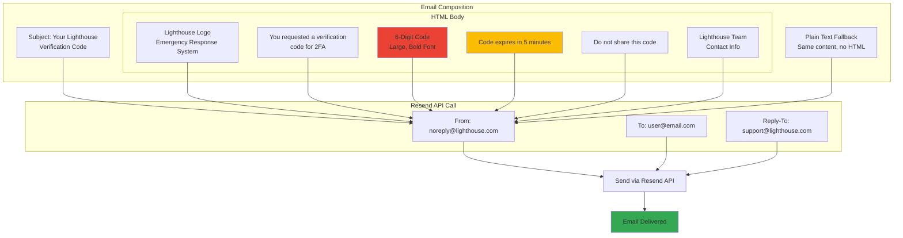

---

## Complete User Journey

### Citizen Emergency Flow (End-to-End)

```mermaid
flowchart TB
    Start([Citizen Opens App]) --> CheckAuth{Logged<br/>In?}

    CheckAuth -->|No| ShowLogin[Show Login Screen]
    ShowLogin --> EnterCreds[Enter Email + Password]
    EnterCreds --> FirebaseAuth[Firebase Authentication]

    CheckAuth -->|Yes| Check2FA
    FirebaseAuth --> Check2FA{2FA<br/>Enabled?}

    Check2FA -->|Yes| Show2FA[Show 2FA Verification]
    Show2FA --> Enter2FA[Enter TOTP/Email Code]
    Enter2FA --> Verify2FA[Verify Code]
    Verify2FA --> Valid2FA{Valid?}
    Valid2FA -->|No| Show2FA
    Valid2FA -->|Yes| Dashboard

    Check2FA -->|No| Dashboard[Show Citizen Dashboard]

    Dashboard --> ViewMap[View Map with<br/>Current Location]
    ViewMap --> Emergency{Emergency<br/>Situation?}

    Emergency -->|No| BrowseFeatures[Browse Features:<br/>- Medical Info<br/>- Settings<br/>- Facilities]
    BrowseFeatures --> End1([End])

    Emergency -->|Yes| PressSOSButton[Press SOS Button]
    PressSOSButton --> SelectServices[Select Emergency Services<br/>☑ Police<br/>☑ Ambulance<br/>☑ Fire]
    SelectServices --> AddDescription[Add Description<br/>Upload Photos/Videos]
    AddDescription --> ConfirmAlert[Confirm Emergency Alert]

    ConfirmAlert --> CreateAlert[Create Alert in Firestore<br/>Status: pending]
    CreateAlert --> NotifyDispatchers[FCM Notification to<br/>Available Dispatchers]

    NotifyDispatchers --> WaitAcceptance[Wait for Dispatcher<br/>to Accept]

    WaitAcceptance --> AlertAccepted{Dispatcher<br/>Accepts?}

    AlertAccepted -->|Timeout| ShowTimeout[No Dispatcher Available<br/>Try Again or Cancel]
    ShowTimeout --> End2([End])

    AlertAccepted -->|Yes| ShowAccepted[Show "Help is on the way!"<br/>Dispatcher Info<br/>Real-time Location]

    ShowAccepted --> ReceiveCall{Incoming<br/>Call?}

    ReceiveCall -->|Yes| ShowCallDialog[Show Call Dialog<br/>Accept / Decline]
    ShowCallDialog --> AcceptCall{Accept?}
    AcceptCall -->|Yes| JoinCall[Join LiveKit Room<br/>Start Video/Audio]
    AcceptCall -->|No| DeclineCall[Decline Call]

    JoinCall --> InCall[In Call with Dispatcher<br/>- Video/Audio<br/>- Mute/Unmute<br/>- Toggle Camera]
    InCall --> CallEnds{Call<br/>Ends?}
    CallEnds -->|Yes| ReturnToMap

    DeclineCall --> ReturnToMap[Return to Map View<br/>Track Dispatcher Location]
    ReceiveCall -->|No| ReturnToMap

    ReturnToMap --> DispatcherArrives{Dispatcher<br/>Arrives?}
    DispatcherArrives -->|No| ReturnToMap
    DispatcherArrives -->|Yes| ShowArrived[Show "Dispatcher Arrived"<br/>Status: arrived]

    ShowArrived --> Resolution[Emergency Handled<br/>On Site]
    Resolution --> DispatcherResolves[Dispatcher Marks Resolved<br/>Add Resolution Notes]

    DispatcherResolves --> ShowResolved[Show "Emergency Resolved"<br/>Thank You Message]
    ShowResolved --> ViewHistory[View Alert History]
    ViewHistory --> End3([End])

    style PressSOSButton fill:#EA4335
    style CreateAlert fill:#EA4335
    style ShowAccepted fill:#34A853
    style JoinCall fill:#00D4AA
    style ShowResolved fill:#4285F4
```

### Dispatcher Response Flow (End-to-End)

```mermaid
flowchart TB
    Start([Dispatcher Opens App]) --> CheckAuth{Logged<br/>In?}

    CheckAuth -->|No| ShowLogin[Show Login Screen]
    ShowLogin --> Login[Login with Credentials]
    Login --> Dashboard

    CheckAuth -->|Yes| Dashboard[Show Dispatcher Dashboard]

    Dashboard --> MonitorAlerts[Monitor Alert Feed<br/>Real-time StreamBuilder]

    MonitorAlerts --> NewAlert{New Alert<br/>Arrives?}

    NewAlert -->|No| MonitorAlerts
    NewAlert -->|Yes| PushNotif[Receive FCM Push<br/>Notification Sound]

    PushNotif --> ReviewAlert[Review Alert Details:<br/>- Location<br/>- Services Needed<br/>- Description<br/>- Photos/Videos]

    ReviewAlert --> DecideAction{Accept<br/>Alert?}

    DecideAction -->|No| DismissAlert[Dismiss Alert<br/>Continue Monitoring]
    DismissAlert --> MonitorAlerts

    DecideAction -->|Yes| AcceptAlert[Click "Accept Alert"]
    AcceptAlert --> UpdateFirestore[Update Firestore<br/>Status: active<br/>acceptedBy: dispatcher_id]

    UpdateFirestore --> ViewAlertMap[View Alert on Map<br/>Calculate Route<br/>Show Distance/ETA]

    ViewAlertMap --> InitiateCall{Need to<br/>Call Citizen?}

    InitiateCall -->|Yes| StartCall[Click "Call" Button]
    StartCall --> CreateCallDoc[Create Call Document<br/>Status: ringing]
    CreateCallDoc --> RequestToken[Request LiveKit Token<br/>from Cloud Function]
    RequestToken --> JoinRoom[Join LiveKit Room]

    JoinRoom --> WaitAnswer[Wait for Citizen<br/>to Answer]
    WaitAnswer --> Answered{Citizen<br/>Answers?}

    Answered -->|No| MissedCall[Call Declined/Missed<br/>Return to Map]
    Answered -->|Yes| ActiveCall[Active Video/Audio Call<br/>- Assess Situation<br/>- Provide Instructions<br/>- Gather Info]

    ActiveCall --> EndCall[End Call when Done]
    EndCall --> MissedCall

    InitiateCall -->|No| NavigateToSite
    MissedCall --> NavigateToSite[Navigate to Site<br/>Follow Google Maps Route]

    NavigateToSite --> Arrived{Arrived<br/>at Site?}

    Arrived -->|No| UpdateLocation[Update Real-time<br/>Location for Citizen]
    UpdateLocation --> NavigateToSite

    Arrived -->|Yes| MarkArrived[Click "I've Arrived"]
    MarkArrived --> UpdateStatus[Update Firestore<br/>Status: arrived<br/>arrivedAt: timestamp]

    UpdateStatus --> HandleEmergency[Handle Emergency<br/>On Site]

    HandleEmergency --> AccessMedical{Need Medical<br/>Info?}

    AccessMedical -->|Yes| ViewMedical[View Encrypted<br/>Medical Information<br/>- Blood Type<br/>- Allergies<br/>- Medications<br/>- Conditions]
    ViewMedical --> ResolveSituation

    AccessMedical -->|No| ResolveSituation[Resolve Emergency<br/>Situation]

    ResolveSituation --> MarkResolved[Click "Mark as Resolved"]
    MarkResolved --> AddNotes[Add Resolution Notes<br/>Document Actions Taken]

    AddNotes --> UpdateResolved[Update Firestore<br/>Status: resolved<br/>resolvedAt: timestamp<br/>resolutionNotes: text]

    UpdateResolved --> ViewAnalytics[View Analytics<br/>Dashboard Updates]

    ViewAnalytics --> End1([Return to Monitoring])
    End1 --> MonitorAlerts

    style AcceptAlert fill:#34A853
    style StartCall fill:#00D4AA
    style ActiveCall fill:#00D4AA
    style MarkArrived fill:#FBBC04
    style MarkResolved fill:#4285F4
```

---

## Performance and Optimization

### Data Caching Strategy

```mermaid
graph TB
    subgraph "Client App"
        UI[Flutter UI]

        subgraph "Cache Layers"
            Memory[In-Memory Cache<br/>Service-level State]
            LocalDB[Firestore Local<br/>Persistence Cache]
            ServiceWorker[Service Worker Cache<br/>PWA Assets]
        end
    end

    subgraph "Backend"
        Firestore[(Cloud Firestore)]
        Storage[(Firebase Storage)]
        CDN[Firebase CDN]
    end

    UI -->|Read| Memory
    Memory -->|Cache Miss| LocalDB
    LocalDB -->|Cache Miss| Firestore

    UI -->|Assets| ServiceWorker
    ServiceWorker -->|Cache Miss| CDN

    Firestore -->|Real-time Sync| LocalDB
    LocalDB -->|Update| Memory
    Memory -->|Rebuild| UI

    Storage --> CDN

    style Memory fill:#4285F4
    style LocalDB fill:#34A853
    style ServiceWorker fill:#FBBC04
```

### Real-time Update Optimization

```mermaid
flowchart LR
    subgraph "Firestore Updates"
        AlertCreate[Alert Created<br/>in Firestore]
        AlertUpdate[Alert Updated<br/>in Firestore]
    end

    subgraph "Client Listeners"
        Listener1[Citizen App<br/>StreamBuilder<br/>Query: userId == me]
        Listener2[Dispatcher App 1<br/>StreamBuilder<br/>Query: status == pending]
        Listener3[Dispatcher App 2<br/>StreamBuilder<br/>Query: status == pending]
    end

    subgraph "Optimization Techniques"
        IndexedQuery[Composite Index<br/>status + createdAt]
        Pagination[Limit to 20 results<br/>OrderBy timestamp DESC]
        Debounce[Debounced Marker Updates<br/>100ms delay]
    end

    AlertCreate --> IndexedQuery
    AlertUpdate --> IndexedQuery

    IndexedQuery --> Listener1
    IndexedQuery --> Listener2
    IndexedQuery --> Listener3

    Listener1 --> Pagination
    Listener2 --> Pagination
    Listener3 --> Pagination

    Pagination --> Debounce

    Debounce --> UIUpdate[Selective UI Rebuild<br/>Only affected widgets]

    style IndexedQuery fill:#EA4335
    style Pagination fill:#FBBC04
    style Debounce fill:#34A853
```

---

## Security Implementation

### Multi-Layer Security Model

```mermaid
graph TB
    subgraph "Layer 1: Network Security"
        HTTPS[HTTPS/TLS 1.3]
        WSS[WebSocket Secure<br/>wss://]
        SRTP[SRTP Encrypted Media]
    end

    subgraph "Layer 2: Authentication"
        FirebaseAuth[Firebase Auth<br/>Email + Password]
        TwoFA[Two-Factor Auth<br/>TOTP / Email]
        SessionMgmt[Session Management<br/>Real-time Monitoring]
    end

    subgraph "Layer 3: Authorization"
        RBAC[Role-Based Access<br/>Citizen / Dispatcher]
        SecurityRules[Firestore Rules<br/>User-specific Access]
        APIKeys[API Key Restrictions<br/>Domain/App-specific]
    end

    subgraph "Layer 4: Data Protection"
        AES256[AES-256-CBC<br/>Medical Data Encryption]
        KeyDerivation[SHA-256 Key<br/>Derived from UID]
        SecretManager[Firebase Secret Manager<br/>API Credentials]
    end

    subgraph "Layer 5: Input Validation"
        ClientValidation[Client-Side Validators<br/>Email, Phone, Password]
        ServerValidation[Firestore Rules<br/>Schema Validation]
        Sanitization[Input Sanitization<br/>XSS Prevention]
    end

    User[User Device] --> HTTPS
    HTTPS --> FirebaseAuth
    FirebaseAuth --> TwoFA
    TwoFA --> SessionMgmt

    SessionMgmt --> RBAC
    RBAC --> SecurityRules
    SecurityRules --> APIKeys

    APIKeys --> AES256
    AES256 --> KeyDerivation
    KeyDerivation --> SecretManager

    SecretManager --> ClientValidation
    ClientValidation --> ServerValidation
    ServerValidation --> Sanitization

    Sanitization --> DataAccess[(Secure Data Access)]

    WSS --> HTTPS
    SRTP --> WSS

    style HTTPS fill:#4285F4
    style TwoFA fill:#EA4335
    style AES256 fill:#34A853
    style SecurityRules fill:#FBBC04
```

---

## Conclusion

These comprehensive diagrams provide detailed visual documentation of the Lighthouse Emergency Response System's architecture, flows, and implementation details. They complement the main [ARCHITECTURE.md](ARCHITECTURE.md) document and serve as reference material for:

- ✅ **Development**: Understanding system interactions and dependencies
- ✅ **Debugging**: Tracing data flow and identifying bottlenecks
- ✅ **Documentation**: Academic project evaluation and presentation
- ✅ **Onboarding**: Helping new developers understand the system
- ✅ **Security Audits**: Visualizing security layers and data protection

---

---

## Firestore Database Schema (Class Diagram)

### Complete Database Structure with All Collections and Fields

```mermaid
classDiagram
    %% Main Collections
    class users {
        <<collection>>
        +String uid (document ID)
        +String email
        +String name
        +String phone
        +String role (citizen|dispatcher)
        +Boolean isActive
        +String fcmToken (deprecated)
        +Array~Object~ fcmTokens
        +Timestamp lastTokenUpdate
        +Boolean twoFactorEnabled
        +String twoFactorMethod (email|sms|totp|none)
        +String totpSecret (encrypted)
        +Timestamp createdAt
        +Timestamp updatedAt
    }

    class medical_info {
        <<subcollection of users>>
        +String encryptedData (base64)
        +String iv (base64)
        +String emergencyContactPhone
        +Timestamp updatedAt
        +Timestamp createdAt
    }

    class medical_info_access_log {
        <<subcollection of users>>
        +String accessedBy (dispatcher UID)
        +Timestamp accessedAt
    }

    class emergency_alerts {
        <<collection>>
        +String id (document ID)
        +String userId (citizen UID)
        +String userEmail
        +GeoPoint location (lat, lng)
        +Array~String~ services
        +String description
        +String status (pending|active|arrived|resolved|cancelled)
        +Timestamp createdAt
        +String acceptedBy (dispatcher UID)
        +String acceptedByEmail
        +Timestamp acceptedAt
        +Timestamp arrivedAt
        +Timestamp resolvedAt
        +Timestamp cancelledAt
        +String resolutionNotes
        +String cancellationReason
        +Map encryptedMedicalInfo (optional)
    }

    class messages {
        <<subcollection of emergency_alerts>>
        +String id (document ID)
        +String senderId
        +String senderEmail
        +String senderRole (citizen|dispatcher)
        +String messageType (text|image|voice)
        +String message
        +String mediaUrl (optional)
        +Integer voiceDuration (optional)
        +Timestamp timestamp
        +Boolean isRead
    }

    class calls {
        <<subcollection of emergency_alerts>>
        +String id (document ID)
        +String roomName
        +String callerId
        +String receiverId
        +String callerName
        +String callerEmail
        +String receiverName
        +String callerRole (citizen|dispatcher)
        +String type (video|audio)
        +String status (ringing|connecting|active|ended|missed|rejected)
        +Timestamp startedAt
        +Timestamp answeredAt
        +Timestamp endedAt
        +Integer duration (seconds)
    }

    class facilities {
        <<collection>>
        +String id (document ID)
        +String name
        +String type (hospital|clinic|police|firestation)
        +GeoPoint location (lat, lng)
        +String address
        +String phone
        +String hours
        +String createdBy (dispatcher UID)
        +Timestamp createdAt
    }

    class verificationCodes {
        <<collection>>
        +String userId (document ID)
        +String code (6 digits)
        +String method (email|sms)
        +Timestamp createdAt
        +Timestamp expiresAt
        +Boolean used
    }

    class twoFactorSessions {
        <<collection>>
        +String userId (document ID)
        +String sessionId (UUID)
        +Boolean verified
        +Timestamp createdAt
    }

    %% Relationships
    users "1" --> "0..1" medical_info : has encrypted
    users "1" --> "0..*" medical_info_access_log : tracks access
    users "1" --> "0..*" emergency_alerts : creates (citizen)
    users "1" --> "0..*" emergency_alerts : accepts (dispatcher)
    users "1" --> "0..1" verificationCodes : has temporary
    users "1" --> "0..1" twoFactorSessions : has active
    users "1" --> "0..*" facilities : creates (dispatcher)

    emergency_alerts "1" --> "0..*" messages : contains
    emergency_alerts "1" --> "0..*" calls : has
    emergency_alerts "1" --> "0..1" medical_info : references encrypted

    %% Notes
    note for users "Role-based access:\n- citizen: creates alerts\n- dispatcher: accepts/manages alerts"
    note for medical_info "AES-256-CBC encrypted\nKey derived from user UID\nOnly owner + assigned dispatcher can decrypt"
    note for emergency_alerts "Status flow:\npending → active → arrived → resolved\nCan be cancelled anytime before resolved"
    note for calls "WebRTC calls via LiveKit\nToken generated by Cloud Function\nRoom name: call_{alertId}_{timestamp}"
    note for verificationCodes "Expires in 10 minutes\nOne-time use only\nDeleted after verification"
```

### Database Relationships and Cardinality

| Parent Collection | Child Collection/Subcollection | Relationship | Description |
|-------------------|--------------------------------|--------------|-------------|
| `users` | `medical_info` | 1:0..1 | User has optional encrypted medical data |
| `users` | `medical_info_access_log` | 1:0..* | Tracks dispatcher access to medical info |
| `users` | `emergency_alerts` (as creator) | 1:0..* | Citizen creates emergency alerts |
| `users` | `emergency_alerts` (as acceptor) | 1:0..* | Dispatcher accepts/manages alerts |
| `users` | `facilities` | 1:0..* | Dispatcher creates facility pins |
| `users` | `verificationCodes` | 1:0..1 | User has temporary 2FA code |
| `users` | `twoFactorSessions` | 1:0..1 | User has active 2FA session |
| `emergency_alerts` | `messages` | 1:0..* | Alert has chat messages |
| `emergency_alerts` | `calls` | 1:0..* | Alert has video/audio calls |

### Field Types and Constraints

**Data Types Used:**
- `String`: Text fields (email, name, description, etc.)
- `GeoPoint`: Location coordinates (latitude, longitude)
- `Timestamp`: Date/time fields (Firestore server timestamp)
- `Boolean`: True/false flags (isActive, isRead, verified, etc.)
- `Integer`: Numeric values (duration, voiceDuration)
- `Array<String>`: Lists (services, fcmTokens)
- `Array<Object>`: Complex arrays (fcmTokens with metadata)
- `Map`: Nested objects (encryptedMedicalInfo)

**Status Enumerations:**
- **Alert Status**: `pending` | `active` | `arrived` | `resolved` | `cancelled`
- **Call Status**: `ringing` | `connecting` | `active` | `ended` | `missed` | `rejected`
- **User Role**: `citizen` | `dispatcher`
- **2FA Method**: `email` | `sms` | `totp` | `none`
- **Message Type**: `text` | `image` | `voice`
- **Call Type**: `video` | `audio`
- **Facility Type**: `hospital` | `clinic` | `police` | `firestation`

---

## Complete Sequence Diagrams

### 1. SOS Emergency Alert Flow (Complete)

**Description:** Full lifecycle of an emergency alert from creation to resolution, including location tracking, dispatcher assignment, and status updates.

```mermaid
sequenceDiagram
    actor Citizen
    participant CApp as Citizen App
    participant Auth as Firebase Auth
    participant FS as Firestore
    participant FCM as Firebase Cloud Messaging
    participant DApp as Dispatcher App
    actor Dispatcher
    participant GPS as GPS Service

    Note over Citizen,GPS: === PHASE 1: Emergency Alert Creation ===

    Citizen->>CApp: Opens app
    CApp->>Auth: Check authentication
    Auth-->>CApp: User authenticated (citizen)

    CApp->>GPS: Request current location
    GPS-->>CApp: Return coordinates (lat, lng)

    Citizen->>CApp: Presses SOS Button
    CApp->>CApp: Show emergency service selection
    Note over CApp: Services: Police, Ambulance, Fire

    Citizen->>CApp: Selects services + adds description
    CApp->>CApp: Optional: Upload photos/videos
    Citizen->>CApp: Confirms alert creation

    CApp->>FS: Create emergency_alerts document
    Note over FS: {<br/>  userId: citizen_uid,<br/>  userEmail: email,<br/>  location: GeoPoint(lat, lng),<br/>  services: ["ambulance", "police"],<br/>  description: "Medical emergency",<br/>  status: "pending",<br/>  createdAt: serverTimestamp()<br/>}

    FS->>FS: Check for medical_info
    alt Citizen has medical info
        FS->>FS: Include encryptedMedicalInfo in alert
        Note over FS: {<br/>  encryptedData: base64,<br/>  iv: base64,<br/>  ownerId: citizen_uid<br/>}
    end

    FS-->>CApp: Alert created successfully
    CApp->>CApp: Show "Help is on the way!" message
    CApp->>CApp: Start real-time alert listener

    Note over Citizen,GPS: === PHASE 2: Dispatcher Notification ===

    FS->>FS: Query active dispatchers
    FS->>FCM: Send push notification to dispatchers
    Note over FCM: Notification payload:<br/>"New emergency alert nearby"<br/>+ alert details

    FCM-->>DApp: Push notification received
    DApp->>DApp: Show notification badge + sound
    DApp->>FS: Real-time listener for pending alerts
    FS-->>DApp: Stream pending alerts

    Dispatcher->>DApp: Opens app / clicks notification
    DApp->>Auth: Check authentication
    Auth-->>DApp: User authenticated (dispatcher)

    DApp->>DApp: Show alert feed (StreamBuilder)
    Dispatcher->>DApp: Views alert details
    Note over DApp: - Location on map<br/>- Services needed<br/>- Description<br/>- Distance/ETA<br/>- Medical info indicator

    Note over Citizen,GPS: === PHASE 3: Alert Acceptance ===

    Dispatcher->>DApp: Clicks "Accept Alert"
    DApp->>FS: Update emergency_alerts/{alertId}
    Note over FS: {<br/>  status: "active",<br/>  acceptedBy: dispatcher_uid,<br/>  acceptedByEmail: email,<br/>  acceptedAt: serverTimestamp()<br/>}

    FS-->>DApp: Update successful
    FS->>CApp: Real-time sync (alert accepted)

    CApp->>CApp: Update UI
    CApp->>CApp: Show dispatcher info + location
    CApp->>CApp: Show "Dispatcher X is on the way!"

    DApp->>DApp: Calculate route to citizen location
    DApp->>GPS: Start continuous location tracking

    loop Real-time location updates
        GPS-->>DApp: New dispatcher location
        DApp->>FS: Update dispatcher location
        FS->>CApp: Real-time sync
        CApp->>CApp: Update dispatcher marker on map
    end

    Note over Citizen,GPS: === PHASE 4: En Route (Optional Communication) ===

    opt Dispatcher initiates call
        Dispatcher->>DApp: Clicks "Call Citizen"
        Note over DApp,CApp: See "Video/Audio Call Flow" diagram
    end

    opt Send chat message
        Dispatcher->>DApp: Sends message "On my way, ETA 5 min"
        DApp->>FS: Create message in<br/>emergency_alerts/{alertId}/messages
        Note over FS: {<br/>  senderId: dispatcher_uid,<br/>  senderRole: "dispatcher",<br/>  messageType: "text",<br/>  message: "On my way, ETA 5 min",<br/>  timestamp: serverTimestamp(),<br/>  isRead: false<br/>}
        FS->>CApp: Real-time sync
        CApp->>CApp: Show message notification
        Citizen->>CApp: Reads message
        CApp->>FS: Update isRead = true
    end

    Note over Citizen,GPS: === PHASE 5: Arrival ===

    DApp->>DApp: Detects proximity to destination
    Dispatcher->>DApp: Clicks "I've Arrived"
    DApp->>FS: Update emergency_alerts/{alertId}
    Note over FS: {<br/>  status: "arrived",<br/>  arrivedAt: serverTimestamp()<br/>}

    FS-->>DApp: Update successful
    FS->>CApp: Real-time sync (arrived)
    CApp->>CApp: Show "Dispatcher has arrived"
    CApp->>CApp: Update status badge

    Note over Citizen,GPS: === PHASE 6: On-Site Assessment ===

    opt Dispatcher accesses medical info
        Dispatcher->>DApp: Clicks "View Medical Info"
        DApp->>FS: Read emergency_alerts/{alertId}<br/>.encryptedMedicalInfo
        FS-->>DApp: Return encrypted data + ownerId
        DApp->>DApp: Decrypt using ownerId as key
        Note over DApp: Uses EncryptionService.decryptToMap()<br/>with citizen's UID
        DApp->>DApp: Display decrypted medical info
        Note over DApp: - Blood type<br/>- Allergies<br/>- Medications<br/>- Conditions<br/>- Emergency contact
        DApp->>FS: Log access in<br/>users/{citizenId}/medical_info_access_log
        Note over FS: {<br/>  accessedBy: dispatcher_uid,<br/>  accessedAt: serverTimestamp()<br/>}
    end

    Dispatcher->>Dispatcher: Handle emergency situation

    Note over Citizen,GPS: === PHASE 7: Resolution ===

    Dispatcher->>DApp: Clicks "Mark as Resolved"
    DApp->>DApp: Show resolution notes dialog
    Dispatcher->>DApp: Adds resolution notes
    Note over DApp: "Patient stabilized,<br/>transported to hospital"

    DApp->>FS: Update emergency_alerts/{alertId}
    Note over FS: {<br/>  status: "resolved",<br/>  resolvedAt: serverTimestamp(),<br/>  resolutionNotes: "Patient stabilized..."<br/>}

    FS-->>DApp: Update successful
    FS->>CApp: Real-time sync (resolved)

    CApp->>CApp: Show "Emergency resolved" message
    CApp->>CApp: Show resolution notes
    CApp->>CApp: Thank you message + feedback option

    DApp->>DApp: Return to dispatcher dashboard
    DApp->>DApp: Alert moved to history

    Note over Citizen,GPS: === PHASE 8: Cleanup ===

    CApp->>GPS: Stop location tracking
    DApp->>GPS: Stop location tracking
    CApp->>FS: Stop real-time listeners
    DApp->>FS: Stop real-time listeners

    Note over Citizen,GPS: Alert lifecycle complete
```

### 2. Video/Audio Call Flow (Complete)

**Description:** Complete WebRTC call flow using LiveKit, including token generation, room connection, media streaming, and call termination.

```mermaid
sequenceDiagram
    actor Dispatcher
    participant DApp as Dispatcher App
    participant DFS as Firestore (Dispatcher)
    participant CF as Cloud Functions
    participant SM as Secret Manager
    participant LK as LiveKit Server
    participant CFS as Firestore (Citizen)
    participant CApp as Citizen App
    participant FCM as FCM
    actor Citizen

    Note over Dispatcher,Citizen: === PHASE 1: Call Initiation ===

    Dispatcher->>DApp: Clicks "Call" button
    DApp->>DApp: Show call type selection
    Dispatcher->>DApp: Selects "Video Call"

    DApp->>DFS: Create call document
    Note over DFS: emergency_alerts/{alertId}/calls/{callId}<br/>{<br/>  roomName: "call_{alertId}_{timestamp}",<br/>  callerId: dispatcher_uid,<br/>  receiverId: citizen_uid,<br/>  callerName: "Dispatcher Name",<br/>  callerEmail: "dispatcher@email.com",<br/>  callerRole: "dispatcher",<br/>  receiverName: "Citizen Name",<br/>  type: "video",<br/>  status: "ringing",<br/>  startedAt: serverTimestamp()<br/>}

    DFS-->>DApp: Call document created (ID: call_123)
    DApp->>DApp: Set up call state listener

    DFS->>CFS: Real-time sync (new call)
    CFS->>CApp: Call document update
    CApp->>CApp: Detect new call (status: ringing)

    CFS->>FCM: Trigger push notification
    Note over FCM: Title: "Incoming Emergency Call"<br/>Body: "Dispatcher is calling..."
    FCM-->>CApp: Push notification delivered

    CApp->>CApp: Show incoming call dialog
    Note over CApp: Caller: Dispatcher Name<br/>Type: Video Call<br/>[Accept] [Decline]

    Note over Dispatcher,Citizen: === PHASE 2: Call Acceptance ===

    Citizen->>CApp: Clicks "Accept"
    CApp->>CFS: Update call status
    Note over CFS: {<br/>  status: "connecting",<br/>  answeredAt: serverTimestamp()<br/>}

    CFS->>DFS: Real-time sync
    DFS->>DApp: Call status updated to "connecting"
    DApp->>DApp: Show "Connecting..." message

    Note over Dispatcher,Citizen: === PHASE 3: LiveKit Token Generation ===

    par Dispatcher gets token
        DApp->>CF: HTTPS Callable: generateLiveKitToken
        Note over CF: Request payload:<br/>{<br/>  alertId: "alert_123",<br/>  callId: "call_123",<br/>  roomName: "call_alert123_1234567890"<br/>}

        CF->>CF: Validate authentication token
        CF->>CF: Check user is caller or receiver

        CF->>SM: Access LIVEKIT_API_KEY
        SM-->>CF: Return API key
        CF->>SM: Access LIVEKIT_API_SECRET
        SM-->>CF: Return API secret

        CF->>CF: Generate JWT token
        Note over CF: JWT Payload:<br/>{<br/>  sub: dispatcher_uid,<br/>  video: {<br/>    room: "call_alert123_1234567890",<br/>    roomJoin: true,<br/>    canPublish: true,<br/>    canSubscribe: true<br/>  },<br/>  exp: now + 24h<br/>}

        CF-->>DApp: Return LiveKit token + server URL
    and Citizen gets token
        CApp->>CF: HTTPS Callable: generateLiveKitToken
        Note over CF: Same request structure
        CF->>CF: Validate + generate token
        CF-->>CApp: Return LiveKit token + server URL
    end

    Note over Dispatcher,Citizen: === PHASE 4: WebRTC Connection ===

    par Connect to LiveKit Room
        DApp->>DApp: Create Room instance
        DApp->>LK: Connect with token
        Note over LK: WebSocket connection:<br/>wss://livekit-server.cloud/ws

        LK->>LK: Validate JWT signature
        LK->>LK: Check token expiry
        LK->>LK: Verify room permissions
        LK-->>DApp: Connection established

        DApp->>DApp: Set up room event listeners
        Note over DApp: - ParticipantConnectedEvent<br/>- TrackPublishedEvent<br/>- TrackSubscribedEvent<br/>- RoomDisconnectedEvent
    and
        CApp->>CApp: Create Room instance
        CApp->>LK: Connect with token
        LK->>LK: Validate JWT + permissions
        LK-->>CApp: Connection established
        CApp->>CApp: Set up room event listeners
    end

    Note over Dispatcher,Citizen: === PHASE 5: Media Track Publishing ===

    par Publish Local Tracks
        DApp->>DApp: Request camera permission
        DApp->>DApp: Request microphone permission
        DApp->>LK: Publish video track
        Note over LK: Video codec: VP8/H.264<br/>Resolution: 720p
        DApp->>LK: Publish audio track
        Note over LK: Audio codec: Opus<br/>Sample rate: 48kHz

        LK->>LK: Receive media tracks
        LK->>CApp: TrackPublishedEvent
        CApp->>CApp: Subscribe to remote tracks
        LK->>CApp: Stream remote video/audio
        CApp->>CApp: Render remote video in VideoRenderer
    and
        CApp->>CApp: Request camera + microphone
        CApp->>LK: Publish video track
        CApp->>LK: Publish audio track

        LK->>LK: Receive media tracks
        LK->>DApp: TrackPublishedEvent
        DApp->>DApp: Subscribe to remote tracks
        LK->>DApp: Stream remote video/audio
        DApp->>DApp: Render remote video
    end

    par Update Call Status
        DApp->>DFS: Update call status
        Note over DFS: {<br/>  status: "active"<br/>}
    and
        CApp->>CFS: Update call status
        Note over CFS: {<br/>  status: "active"<br/>}
    end

    Note over Dispatcher,Citizen: === PHASE 6: Active Call (Media Streaming) ===

    Note over DApp,CApp: Live bidirectional media streaming<br/>Encrypted with SRTP<br/>Adaptive bitrate based on network

    opt Media Controls
        alt Dispatcher toggles mute
            Dispatcher->>DApp: Clicks mute button
            DApp->>DApp: localParticipant.setMicrophoneEnabled(false)
            DApp->>LK: Stop publishing audio track
            DApp->>DApp: Update UI (mute icon)
        else Citizen toggles video
            Citizen->>CApp: Clicks video off
            CApp->>CApp: localParticipant.setCameraEnabled(false)
            CApp->>LK: Stop publishing video track
            CApp->>CApp: Dispose local video track
            LK->>DApp: TrackUnsubscribedEvent
            DApp->>DApp: Hide remote video (show avatar)
        end
    end

    Note over Dispatcher,Citizen: === PHASE 7: Call Termination ===

    alt Dispatcher ends call
        Dispatcher->>DApp: Clicks "End Call"
        DApp->>DApp: Calculate call duration
        Note over DApp: duration = now - answeredAt (seconds)

        DApp->>DFS: Update call document
        Note over DFS: {<br/>  status: "ended",<br/>  endedAt: serverTimestamp(),<br/>  duration: 180<br/>}

        DApp->>DApp: Stop local tracks
        DApp->>DApp: localVideoTrack.stop()
        DApp->>DApp: localAudioTrack.stop()
        DApp->>DApp: Dispose tracks

        DApp->>LK: Disconnect from room
        LK-->>DApp: Disconnected
        DApp->>DApp: Dispose room instance

        DFS->>CFS: Real-time sync (call ended)
        CFS->>CApp: Call status: ended
        CApp->>CApp: Show "Call ended" message
        CApp->>CApp: Stop local tracks + disconnect
        CApp->>LK: Disconnect from room
        CApp->>CApp: Close call screen

    else Citizen ends call
        Citizen->>CApp: Clicks "End Call"
        CApp->>CFS: Update call status: ended
        CApp->>CApp: Cleanup tracks + disconnect
        CApp->>LK: Disconnect

        CFS->>DFS: Real-time sync
        DFS->>DApp: Call ended notification
        DApp->>DApp: Cleanup + disconnect
        DApp->>LK: Disconnect

    else Network disconnection
        LK->>DApp: RoomDisconnectedEvent (network error)
        DApp->>DApp: Auto-cleanup resources
        LK->>CApp: RoomDisconnectedEvent
        CApp->>CApp: Auto-cleanup resources
    end

    Note over Dispatcher,Citizen: === PHASE 8: Cleanup ===

    DApp->>DApp: Navigate back to alert view
    CApp->>CApp: Return to emergency alert screen

    Note over Dispatcher,Citizen: Call complete
```

### 3. Two-Factor Authentication Flow (Complete)

**Description:** Complete 2FA flow including TOTP setup, email/SMS verification, login gate, and session management.

```mermaid
sequenceDiagram
    actor User
    participant App as Flutter App
    participant Auth as Firebase Auth
    participant FS as Firestore
    participant 2FA as TwoFactorService
    participant CF as Cloud Functions
    participant Email as Email Service (Resend)
    participant SMS as SMS Service (Twilio)
    participant AuthApp as Authenticator App

    Note over User,AuthApp: === SCENARIO A: 2FA Setup (TOTP) ===

    User->>App: Navigate to Settings > 2FA
    App->>FS: Check current 2FA status
    FS-->>App: twoFactorEnabled: false

    App->>App: Show "Enable 2FA" button
    User->>App: Clicks "Enable 2FA"
    App->>App: Show method selection dialog
    Note over App: Options:<br/>- Authenticator App (TOTP)<br/>- Email Verification<br/>- SMS Verification

    User->>App: Selects "Authenticator App"

    App->>2FA: generateTOTPSecret()
    2FA->>2FA: Generate random 32-char base32 secret
    Note over 2FA: Uses secure random generator<br/>Chars: A-Z, 2-7 (base32)
    2FA-->>App: Return secret (e.g., "JBSWY3DPEHPK3PXP")

    App->>App: Generate OTP Auth URL
    Note over App: otpauth://totp/Lighthouse Emergency:user@email.com<br/>?secret=JBSWY3DPEHPK3PXP<br/>&issuer=Lighthouse Emergency<br/>&algorithm=SHA1<br/>&digits=6<br/>&period=30

    App->>App: Generate QR code from URL
    App->>App: Display setup dialog
    Note over App: [QR Code Image]<br/>Manual entry code:<br/>JBSW Y3DP EHPK 3PXP<br/><br/>[Enter verification code]

    User->>AuthApp: Opens Google Authenticator
    User->>AuthApp: Scans QR code
    AuthApp->>AuthApp: Adds "Lighthouse Emergency" account
    AuthApp->>AuthApp: Generate 6-digit code (TOTP)
    Note over AuthApp: Uses current timestamp<br/>30-second window
    AuthApp-->>User: Displays code (e.g., "123456")

    User->>App: Enters code "123456"
    App->>2FA: verifyTOTPCode(code: "123456", secret: "JBSWY...")

    2FA->>2FA: Get current timestamp
    2FA->>2FA: Generate expected code for current window
    Note over 2FA: OTP.generateTOTPCodeString(<br/>  secret, currentTime,<br/>  length: 6, interval: 30<br/>)

    2FA->>2FA: Compare codes

    alt Code matches current window
        2FA-->>App: Valid ✓
    else Check previous window (30s ago)
        2FA->>2FA: Generate code for previous window
        alt Code matches previous window
            2FA-->>App: Valid ✓ (clock skew tolerance)
        else Check next window (30s ahead)
            2FA->>2FA: Generate code for next window
            alt Code matches next window
                2FA-->>App: Valid ✓ (clock skew tolerance)
            else No match
                2FA-->>App: Invalid ✗
                App->>App: Show error "Invalid code"
                App->>App: User can retry
            end
        end
    end

    App->>FS: Save 2FA settings
    Note over FS: users/{uid}<br/>{<br/>  twoFactorEnabled: true,<br/>  twoFactorMethod: "totp",<br/>  totpSecret: "JBSWY3DPEHPK3PXP",<br/>  twoFactorEnabledAt: serverTimestamp()<br/>}

    FS-->>App: Settings saved
    App->>App: Show success message
    App->>App: Display backup codes
    Note over App: Backup codes for account recovery

    Note over User,AuthApp: === SCENARIO B: 2FA Setup (Email) ===

    User->>App: Selects "Email Verification"
    App->>2FA: generateVerificationCode()
    2FA->>2FA: Generate random 6-digit code
    Note over 2FA: Random.secure().nextInt(900000) + 100000
    2FA-->>App: Return code (e.g., "847293")

    App->>FS: Store verification code
    Note over FS: verificationCodes/{uid}<br/>{<br/>  code: "847293",<br/>  method: "email",<br/>  createdAt: serverTimestamp(),<br/>  expiresAt: now + 10 minutes,<br/>  used: false<br/>}

    App->>CF: Call sendEmail function
    Note over CF: {<br/>  to: "user@email.com",<br/>  subject: "2FA Verification Code",<br/>  html: email_template<br/>}

    CF->>Email: Send via Resend API
    Email-->>User: Delivers email with code

    App->>App: Show "Check your email" dialog
    User->>App: Enters code from email

    App->>2FA: verifyStoredCode(uid, code)
    2FA->>FS: Query verificationCodes/{uid}
    FS-->>2FA: Return code document

    2FA->>2FA: Check if code matches
    2FA->>2FA: Check if not expired (expiresAt > now)
    2FA->>2FA: Check if not used

    alt Valid code
        2FA->>FS: Update: used = true
        2FA-->>App: Valid ✓
        App->>FS: Enable 2FA
        Note over FS: users/{uid}<br/>{<br/>  twoFactorEnabled: true,<br/>  twoFactorMethod: "email"<br/>}
    else Invalid/Expired
        2FA-->>App: Invalid ✗
        App->>App: Show error + resend option
    end

    Note over User,AuthApp: === SCENARIO C: Login with 2FA (Gate) ===

    User->>App: Opens app
    App->>Auth: Check authentication state
    Auth-->>App: Not logged in

    App->>App: Show login screen
    User->>App: Enters email + password
    App->>Auth: signInWithEmailAndPassword()
    Auth->>Auth: Validate credentials

    alt Invalid credentials
        Auth-->>App: Error (wrong password/user not found)
        App->>App: Show error message
    else Valid credentials
        Auth-->>App: User signed in successfully
        App->>Auth: Get current user UID

        App->>FS: Check 2FA status
        Note over FS: Query: users/{uid}.twoFactorEnabled
        FS-->>App: twoFactorEnabled: true, method: "totp"

        App->>App: Navigate to TwoFactorGate
        Note over App: Blocks dashboard access<br/>Shows 2FA verification screen

        alt Method is TOTP
            App->>App: Show TOTP input field
            Note over App: "Enter code from authenticator app"

            User->>AuthApp: Opens authenticator
            AuthApp-->>User: Shows current code
            User->>App: Enters code

            App->>FS: Get totpSecret from users/{uid}
            FS-->>App: Return encrypted secret

            App->>2FA: verifyTOTPCode(code, secret)
            2FA-->>App: Valid ✓

        else Method is Email
            App->>2FA: Generate + send email code
            2FA->>FS: Store in verificationCodes
            2FA->>CF: Send email

            App->>App: Show email input field
            User->>App: Enters code from email
            App->>2FA: verifyStoredCode()
            2FA-->>App: Valid ✓

        else Method is SMS
            App->>2FA: Generate + send SMS code
            2FA->>FS: Store in verificationCodes
            2FA->>CF: Send SMS via Twilio

            App->>App: Show SMS input field
            User->>App: Enters code from SMS
            App->>2FA: verifyStoredCode()
            2FA-->>App: Valid ✓
        end

        App->>FS: Create 2FA session
        Note over FS: twoFactorSessions/{uid}<br/>{<br/>  sessionId: UUID,<br/>  verified: true,<br/>  createdAt: serverTimestamp()<br/>}

        App->>App: Navigate to Dashboard
        App->>FS: Set up session listener
        Note over App: Real-time monitoring<br/>for session invalidation

        loop Monitor Session
            FS-->>App: Session still exists
            alt Session deleted remotely
                FS-->>App: Session deleted
                App->>Auth: Sign out
                App->>App: Navigate to login
            end
        end
    end

    Note over User,AuthApp: 2FA flow complete
```

### 4. Medical Info Access Flow (Complete)

**Description:** Secure flow for accessing encrypted medical information during emergencies, including encryption, decryption, and access logging.

```mermaid
sequenceDiagram
    actor Citizen
    participant CApp as Citizen App
    participant Enc as EncryptionService
    participant Auth as Firebase Auth
    participant FS as Firestore
    participant DApp as Dispatcher App
    actor Dispatcher

    Note over Citizen,Dispatcher: === PHASE 1: Medical Info Creation (Citizen) ===

    Citizen->>CApp: Navigate to Medical Info
    CApp->>FS: Check if medical info exists
    FS-->>CApp: No medical info found

    CApp->>CApp: Show medical info form
    Citizen->>CApp: Fills out form
    Note over CApp: - Blood Type: O+<br/>- Allergies: ["Penicillin", "Peanuts"]<br/>- Medications: ["Insulin"]<br/>- Conditions: ["Diabetes Type 1"]<br/>- Emergency Contact:<br/>  * Name: John Doe<br/>  * Phone: +60123456789<br/>  * Relationship: Spouse

    Citizen->>CApp: Clicks "Save"

    CApp->>CApp: Create MedicalInfo object
    Note over CApp: MedicalInfo(<br/>  bloodType: "O+",<br/>  allergies: ["Penicillin", "Peanuts"],<br/>  medications: ["Insulin"],<br/>  conditions: ["Diabetes Type 1"],<br/>  emergencyContact: EmergencyContact(...),<br/>  notes: "Check blood sugar regularly"<br/>)

    CApp->>CApp: Convert to JSON
    Note over CApp: {<br/>  "bloodType": "O+",<br/>  "allergies": ["Penicillin", "Peanuts"],<br/>  "medications": ["Insulin"],<br/>  "conditions": ["Diabetes Type 1"],<br/>  "emergencyContact": {...},<br/>  "notes": "Check blood sugar..."<br/>}

    CApp->>Auth: Get current user UID
    Auth-->>CApp: Return citizen_uid_123

    CApp->>Enc: encryptMap(medicalDataJson, citizen_uid_123)

    Enc->>Enc: Derive encryption key from UID
    Note over Enc: _deriveKeyFromUID(citizen_uid_123)<br/>1. Convert UID to UTF-8 bytes<br/>2. SHA-256 hash<br/>3. Use 32-byte digest as AES key

    Enc->>Enc: Check key cache
    alt Key not in cache
        Enc->>Enc: Generate SHA-256 hash
        Note over Enc: sha256(utf8.encode("citizen_uid_123"))
        Enc->>Enc: Create 32-byte AES key
        Enc->>Enc: Cache key for performance
    else Key in cache
        Enc->>Enc: Retrieve from cache
    end

    Enc->>Enc: Generate random IV (16 bytes)
    Note over Enc: IV.fromSecureRandom(16)<br/>Initialization Vector for CBC mode

    Enc->>Enc: Encrypt with AES-256-CBC
    Note over Enc: Encrypter(AES(key, mode: CBC))<br/>.encrypt(jsonString, iv: iv)

    Enc-->>CApp: Return encrypted result
    Note over CApp: {<br/>  "encryptedData": "base64_encrypted_data...",<br/>  "iv": "base64_iv..."<br/>}

    CApp->>FS: Save to Firestore
    Note over FS: users/{citizen_uid_123}/medical_info/data<br/>{<br/>  encryptedData: "base64...",<br/>  iv: "base64...",<br/>  emergencyContactPhone: "+60123456789",<br/>  updatedAt: serverTimestamp(),<br/>  createdAt: serverTimestamp()<br/>}

    FS-->>CApp: Saved successfully
    CApp->>CApp: Show success message

    Note over Citizen,Dispatcher: === PHASE 2: SOS Alert with Medical Info ===

    Citizen->>CApp: Creates emergency alert
    CApp->>FS: Check for medical info
    FS-->>CApp: Medical info exists

    CApp->>FS: Get encrypted medical info
    FS-->>CApp: Return encryptedData + iv

    CApp->>FS: Create emergency alert with medical info
    Note over FS: emergency_alerts/{alertId}<br/>{<br/>  userId: "citizen_uid_123",<br/>  location: GeoPoint(...),<br/>  services: ["ambulance"],<br/>  description: "Medical emergency",<br/>  status: "pending",<br/>  encryptedMedicalInfo: {<br/>    encryptedData: "base64...",<br/>    iv: "base64...",<br/>    ownerId: "citizen_uid_123"<br/>  },<br/>  createdAt: serverTimestamp()<br/>}

    Note over Citizen,Dispatcher: === PHASE 3: Dispatcher Accepts Alert ===

    Dispatcher->>DApp: Views pending alert
    DApp->>FS: Query emergency_alerts/{alertId}
    FS-->>DApp: Return alert data

    DApp->>DApp: Check if encryptedMedicalInfo exists
    DApp->>DApp: Show "Medical Info Available" indicator

    Dispatcher->>DApp: Accepts alert
    DApp->>FS: Update alert status to "active"

    Note over Citizen,Dispatcher: === PHASE 4: Accessing Medical Info ===

    Dispatcher->>DApp: Clicks "View Medical Info"
    DApp->>DApp: Extract encryptedMedicalInfo from alert
    Note over DApp: {<br/>  encryptedData: "base64...",<br/>  iv: "base64...",<br/>  ownerId: "citizen_uid_123"<br/>}

    DApp->>Enc: decryptToMap(encryptedData, iv, ownerId)
    Note over Enc: IMPORTANT: Uses ownerId (citizen's UID)<br/>NOT dispatcher's UID

    Enc->>Enc: Derive key from ownerId
    Note over Enc: _deriveKeyFromUID("citizen_uid_123")<br/>Must use same UID that encrypted it!

    Enc->>Enc: Check key cache
    alt Key not cached
        Enc->>Enc: Generate SHA-256 hash of citizen_uid_123
        Enc->>Enc: Create AES key
        Enc->>Enc: Cache key
    else Key cached
        Enc->>Enc: Retrieve from cache
    end

    Enc->>Enc: Recreate IV from base64
    Note over Enc: IV.fromBase64(ivBase64)

    Enc->>Enc: Decrypt with AES-256-CBC
    Note over Enc: Encrypter(AES(key, mode: CBC))<br/>.decrypt64(encryptedData, iv: iv)

    Enc->>Enc: Parse decrypted JSON
    Enc-->>DApp: Return decrypted map
    Note over DApp: {<br/>  "bloodType": "O+",<br/>  "allergies": ["Penicillin", "Peanuts"],<br/>  "medications": ["Insulin"],<br/>  "conditions": ["Diabetes Type 1"],<br/>  "emergencyContact": {...},<br/>  "notes": "..."<br/>}

    DApp->>DApp: Convert to MedicalInfo object
    DApp->>DApp: Display in UI
    Note over DApp: Blood Type: O+<br/>⚠️ Allergies:<br/>  • Penicillin<br/>  • Peanuts<br/>💊 Medications:<br/>  • Insulin<br/>🏥 Conditions:<br/>  • Diabetes Type 1<br/>📞 Emergency Contact:<br/>  John Doe (+60123456789)

    Note over Citizen,Dispatcher: === PHASE 5: Access Logging (Audit Trail) ===

    DApp->>Auth: Get current dispatcher UID
    Auth-->>DApp: Return dispatcher_uid_456

    DApp->>FS: Log medical info access
    Note over FS: users/{citizen_uid_123}/<br/>medical_info_access_log/{logId}<br/>{<br/>  accessedBy: "dispatcher_uid_456",<br/>  accessedAt: serverTimestamp()<br/>}

    FS-->>DApp: Log created

    Note over Citizen,Dispatcher: === PHASE 6: Citizen Views Access Log ===

    Citizen->>CApp: Navigate to Medical Info Settings
    CApp->>CApp: Show "View Access Log" button
    Citizen->>CApp: Clicks "View Access Log"

    CApp->>FS: Query access logs
    Note over FS: users/{citizen_uid_123}/<br/>medical_info_access_log<br/>ORDER BY accessedAt DESC

    FS-->>CApp: Return access logs

    CApp->>FS: Get dispatcher details
    Note over FS: For each accessedBy,<br/>query users/{dispatcher_uid}

    FS-->>CApp: Return dispatcher info

    CApp->>CApp: Display access log
    Note over CApp: Medical Info Access History:<br/><br/>✓ Accessed by: Dispatcher Name<br/>  Email: dispatcher@email.com<br/>  Date: Jan 2, 2026 10:45 AM<br/>  Reason: Emergency Alert #123

    Note over Citizen,Dispatcher: === SECURITY GUARANTEES ===

    Note over Enc: ✅ AES-256-CBC encryption<br/>✅ Key derived from citizen UID (SHA-256)<br/>✅ Unique IV per encryption<br/>✅ Key caching for performance<br/>✅ Only owner + assigned dispatcher can decrypt<br/>✅ All access logged for audit<br/>✅ Keys never stored in database<br/>✅ Data encrypted at rest and in transit

    Note over Citizen,Dispatcher: Medical info access flow complete
```

### 5. Real-time Chat Flow (Complete)

**Description:** Real-time messaging between citizen and dispatcher during an active emergency, including message delivery, read receipts, and typing indicators.

```mermaid
sequenceDiagram
    actor Citizen
    participant CApp as Citizen App
    participant CFS as Firestore (Citizen)
    participant FS as Firestore (Server)
    participant DFS as Firestore (Dispatcher)
    participant DApp as Dispatcher App
    participant FCM as Firebase Cloud Messaging
    actor Dispatcher

    Note over Citizen,Dispatcher: === PHASE 1: Alert Context Setup ===

    Note over Citizen,Dispatcher: Prerequisites:<br/>- Emergency alert exists (alertId)<br/>- Alert status: active<br/>- Dispatcher has accepted alert

    Citizen->>CApp: Opens emergency alert screen
    CApp->>CFS: Set up real-time listener
    Note over CFS: emergency_alerts/{alertId}/messages<br/>ORDER BY timestamp ASC

    Dispatcher->>DApp: Opens alert detail screen
    DApp->>DFS: Set up real-time listener
    Note over DFS: Same collection path

    CFS-->>CApp: Initial messages (empty or existing)
    DFS-->>DApp: Initial messages (empty or existing)

    CApp->>CApp: Display chat interface
    DApp->>DApp: Display chat interface

    Note over Citizen,Dispatcher: === PHASE 2: Dispatcher Sends Message ===

    Dispatcher->>DApp: Types message
    Note over DApp: "I'm on my way, ETA 5 minutes"

    opt Show typing indicator
        DApp->>DFS: Update typing status
        Note over DFS: emergency_alerts/{alertId}<br/>{<br/>  dispatcherTyping: true,<br/>  lastTypingUpdate: serverTimestamp()<br/>}

        DFS->>CFS: Real-time sync
        CFS->>CApp: Typing status updated
        CApp->>CApp: Show "Dispatcher is typing..."

        alt Stopped typing (no input for 3 seconds)
            DApp->>DFS: Update typing: false
            DFS->>CFS: Sync
            CApp->>CApp: Hide typing indicator
        end
    end

    Dispatcher->>DApp: Presses Send

    DApp->>DApp: Generate message ID
    DApp->>DApp: Get current user info
    Note over DApp: senderId: dispatcher_uid<br/>senderEmail: dispatcher@email.com<br/>senderRole: "dispatcher"

    DApp->>DFS: Create message document
    Note over DFS: emergency_alerts/{alertId}/messages/{msgId}<br/>{<br/>  senderId: "dispatcher_uid_456",<br/>  senderEmail: "dispatcher@email.com",<br/>  senderRole: "dispatcher",<br/>  messageType: "text",<br/>  message: "I'm on my way, ETA 5 minutes",<br/>  mediaUrl: null,<br/>  voiceDuration: null,<br/>  timestamp: serverTimestamp(),<br/>  isRead: false<br/>}

    DFS-->>DApp: Message created successfully

    DApp->>DApp: Clear input field
    DApp->>DApp: Scroll to bottom
    DApp->>DApp: Show message with "Sent" status

    Note over Citizen,Dispatcher: === PHASE 3: Real-time Message Delivery ===

    DFS->>FS: Firestore propagates change
    FS->>CFS: Real-time sync to citizen's listener

    CFS->>CApp: New message received
    Note over CApp: StreamBuilder rebuilds with new data

    CApp->>CApp: Display message in chat UI
    Note over CApp: [Dispatcher avatar]<br/>Dispatcher Name<br/>"I'm on my way, ETA 5 minutes"<br/>10:45 AM • Unread

    CApp->>CApp: Play notification sound
    CApp->>CApp: Vibrate device (if enabled)

    alt Citizen not viewing chat screen
        CFS->>FCM: Trigger push notification
        Note over FCM: Title: "Message from Dispatcher"<br/>Body: "I'm on my way, ETA 5 minutes"
        FCM-->>CApp: Push notification delivered
        CApp->>CApp: Show notification banner
    end

    CApp->>CApp: Auto-scroll to bottom

    Note over Citizen,Dispatcher: === PHASE 4: Read Receipt ===

    Citizen->>CApp: Views message (enters chat screen)
    CApp->>CApp: Detect message visibility

    CApp->>CFS: Mark message as read
    Note over CFS: emergency_alerts/{alertId}/messages/{msgId}<br/>{<br/>  isRead: true<br/>}

    CFS->>FS: Update propagates
    FS->>DFS: Real-time sync

    DFS->>DApp: Message read status updated
    DApp->>DApp: Update message UI
    Note over DApp: "I'm on my way, ETA 5 minutes"<br/>10:45 AM • ✓✓ Read

    Note over Citizen,Dispatcher: === PHASE 5: Citizen Sends Reply ===

    Citizen->>CApp: Types reply
    Note over CApp: "Thank you, I'm at the main entrance"

    Citizen->>CApp: Presses Send

    CApp->>CFS: Create message document
    Note over CFS: emergency_alerts/{alertId}/messages/{msgId2}<br/>{<br/>  senderId: "citizen_uid_123",<br/>  senderEmail: "citizen@email.com",<br/>  senderRole: "citizen",<br/>  messageType: "text",<br/>  message: "Thank you, I'm at the main entrance",<br/>  timestamp: serverTimestamp(),<br/>  isRead: false<br/>}

    CFS-->>CApp: Message created
    CApp->>CApp: Display message (right-aligned)

    CFS->>FS: Propagate
    FS->>DFS: Real-time sync

    DFS->>DApp: New message received
    DApp->>DApp: Display message (left-aligned)
    DApp->>DApp: Play notification sound

    alt Dispatcher not viewing chat
        DFS->>FCM: Push notification
        FCM-->>DApp: Deliver notification
    end

    Dispatcher->>DApp: Views message
    DApp->>DFS: Mark as read (isRead: true)
    DFS->>FS: Propagate
    FS->>CFS: Sync
    CFS->>CApp: Read receipt delivered
    CApp->>CApp: Show "✓✓ Read"

    Note over Citizen,Dispatcher: === PHASE 6: Image Message ===

    Citizen->>CApp: Clicks attach image button
    CApp->>CApp: Open image picker
    Citizen->>CApp: Selects image from gallery

    CApp->>CApp: Compress image
    Note over CApp: Resize to max 1920x1080<br/>JPEG quality: 85%

    CApp->>CApp: Upload to Firebase Storage
    Note over CApp: storage/emergency_alerts/{alertId}/<br/>messages/{timestamp}_{uuid}.jpg

    CApp->>CApp: Get download URL
    CApp->>CFS: Create message with image
    Note over CFS: emergency_alerts/{alertId}/messages/{msgId3}<br/>{<br/>  senderId: "citizen_uid_123",<br/>  senderRole: "citizen",<br/>  messageType: "image",<br/>  message: "Here's my location" (caption),<br/>  mediaUrl: "https://storage.../image.jpg",<br/>  timestamp: serverTimestamp(),<br/>  isRead: false<br/>}

    CFS->>FS: Propagate
    FS->>DFS: Sync

    DFS->>DApp: New image message
    DApp->>DApp: Display image thumbnail
    Note over DApp: [Image thumbnail 200x200]<br/>"Here's my location"<br/>Tap to view full size

    Dispatcher->>DApp: Taps image
    DApp->>DApp: Open full-screen image viewer
    DApp->>DApp: Load full resolution from mediaUrl

    Note over Citizen,Dispatcher: === PHASE 7: Voice Message ===

    Dispatcher->>DApp: Presses and holds mic button
    DApp->>DApp: Start recording audio
    Note over DApp: Record PCM audio<br/>Sample rate: 16kHz<br/>Mono channel

    DApp->>DApp: Show recording UI
    Note over DApp: 🔴 Recording... 0:05

    Dispatcher->>DApp: Releases button
    DApp->>DApp: Stop recording
    DApp->>DApp: Encode to AAC format

    DApp->>DApp: Upload to Firebase Storage
    Note over DApp: storage/emergency_alerts/{alertId}/<br/>messages/voice_{timestamp}.aac

    DApp->>DFS: Create voice message
    Note over DFS: emergency_alerts/{alertId}/messages/{msgId4}<br/>{<br/>  senderId: "dispatcher_uid_456",<br/>  senderRole: "dispatcher",<br/>  messageType: "voice",<br/>  message: "",<br/>  mediaUrl: "https://storage.../voice.aac",<br/>  voiceDuration: 5,<br/>  timestamp: serverTimestamp(),<br/>  isRead: false<br/>}

    DFS->>FS: Propagate
    FS->>CFS: Sync

    CFS->>CApp: New voice message
    CApp->>CApp: Display voice player
    Note over CApp: 🎤 Voice message (0:05)<br/>[Play button] ────▶ 0:00

    Citizen->>CApp: Taps play button
    CApp->>CApp: Download audio from mediaUrl
    CApp->>CApp: Play audio
    Note over CApp: [Play button] ━━━━▶ 0:03

    CApp->>CFS: Mark as read when played

    Note over Citizen,Dispatcher: === PHASE 8: Message History & Pagination ===

    alt Load older messages
        Citizen->>CApp: Scrolls to top of chat
        CApp->>CApp: Detect scroll position
        CApp->>CFS: Query older messages
        Note over CFS: emergency_alerts/{alertId}/messages<br/>ORDER BY timestamp DESC<br/>LIMIT 20<br/>startAfter(lastMessage.timestamp)

        CFS-->>CApp: Return older messages batch
        CApp->>CApp: Prepend to message list
        CApp->>CApp: Maintain scroll position
    end

    Note over Citizen,Dispatcher: === PHASE 9: Unread Message Count ===

    DApp->>DFS: Query unread messages
    Note over DFS: emergency_alerts/{alertId}/messages<br/>WHERE isRead == false<br/>AND senderId != dispatcher_uid

    DFS-->>DApp: Return count (e.g., 3)
    DApp->>DApp: Show badge on alert item
    Note over DApp: 🔔 3 unread messages

    Note over Citizen,Dispatcher: === PHASE 10: Cleanup ===

    alt Citizen leaves chat screen
        CApp->>CFS: Cancel real-time listener
        CFS->>CApp: Stop streaming updates
    end

    alt Alert resolved
        DApp->>FS: Update alert status: resolved
        FS->>CFS: Sync
        FS->>DFS: Sync

        CApp->>CApp: Show "Alert resolved" banner
        CApp->>CApp: Disable message input
        DApp->>DApp: Show "Alert resolved" banner
        DApp->>DApp: Disable message input
    end

    Note over Citizen,Dispatcher: Chat flow complete
```

---

## High-Level System Sequence Diagram

### Complete Lighthouse Emergency System Flow

**Description:** High-level overview of the entire Lighthouse system from user authentication through emergency resolution, showing all major components and their interactions.

```mermaid
sequenceDiagram
    actor C as Citizen
    actor D as Dispatcher
    participant CA as Citizen App
    participant DA as Dispatcher App
    participant Auth as Firebase Auth
    participant FS as Firestore
    participant Enc as Encryption Service
    participant FCM as Cloud Messaging
    participant CF as Cloud Functions
    participant LK as LiveKit
    participant GPS as Location Services
    participant Maps as Google Maps API

    Note over C,Maps: === SYSTEM INITIALIZATION ===

    rect rgb(230, 240, 255)
        Note over C,Auth: Phase 1: User Authentication & Setup
        C->>CA: Launch app
        CA->>Auth: Authenticate user
        Auth-->>CA: Return user session

        alt 2FA Enabled
            CA->>FS: Check 2FA status
            CA->>CF: Request verification code (Email/SMS/TOTP)
            CF-->>C: Deliver code
            C->>CA: Enter code
            CA->>FS: Verify & create session
        end

        CA->>GPS: Request location permissions
        GPS-->>CA: Grant permissions
        CA->>Maps: Initialize map view
    end

    rect rgb(255, 240, 230)
        Note over C,FS: Phase 2: Medical Information Setup (Optional)
        C->>CA: Navigate to medical info
        C->>CA: Enter medical details
        CA->>Enc: Encrypt medical data (AES-256)
        Enc->>Enc: Derive key from user UID
        Enc-->>CA: Return encrypted data + IV
        CA->>FS: Store encrypted medical info
    end

    rect rgb(255, 230, 230)
        Note over C,Maps: Phase 3: Emergency Alert Creation
        C->>CA: Press SOS button
        CA->>GPS: Get current location
        GPS-->>CA: Return coordinates
        C->>CA: Select services + description

        CA->>FS: Create emergency_alerts document
        Note over FS: status: "pending"<br/>location: GeoPoint<br/>services: array<br/>encryptedMedicalInfo: optional

        FS->>FCM: Notify available dispatchers
        FCM-->>DA: Push notification
    end

    Note over C,Maps: === DISPATCHER RESPONSE ===

    rect rgb(230, 255, 230)
        Note over D,Maps: Phase 4: Dispatcher Authentication & Alert View
        D->>DA: Open app (from notification)
        DA->>Auth: Authenticate dispatcher
        Auth-->>DA: Return session

        alt 2FA Enabled
            DA->>CF: Request 2FA verification
            CF-->>D: Deliver code
            D->>DA: Verify code
        end

        DA->>FS: Stream pending alerts (real-time)
        FS-->>DA: Return pending alerts
        DA->>Maps: Display alert locations
    end

    rect rgb(255, 245, 230)
        Note over D,GPS: Phase 5: Alert Acceptance & Navigation
        D->>DA: Accept alert
        DA->>FS: Update alert status: "active"
        FS-->>CA: Real-time sync (alert accepted)
        CA->>CA: Show "Help on the way"

        DA->>Maps: Calculate route to citizen
        Maps-->>DA: Return directions
        DA->>GPS: Start location tracking

        loop Real-time Location Updates
            GPS->>DA: New dispatcher position
            DA->>FS: Update dispatcher location
            FS->>CA: Sync location
            CA->>CA: Update map marker
        end
    end

    Note over C,Maps: === COMMUNICATION ===

    rect rgb(240, 255, 255)
        Note over C,LK: Phase 6: Communication (Optional)

        par Video/Audio Call
            D->>DA: Initiate call
            DA->>FS: Create call document
            FS->>CA: Real-time sync (incoming call)
            CA->>C: Show call notification
            C->>CA: Accept call

            par Token Generation
                CA->>CF: Request LiveKit token
                CF->>CF: Generate JWT with room permissions
                CF-->>CA: Return token
            and
                DA->>CF: Request LiveKit token
                CF-->>DA: Return token
            end

            par WebRTC Connection
                CA->>LK: Connect to room
                LK->>LK: Establish WebRTC connection
                LK-->>CA: Stream remote media
            and
                DA->>LK: Connect to room
                LK-->>DA: Stream remote media
            end

            Note over CA,DA: Live encrypted video/audio (SRTP)

            alt Call Ends
                D->>DA: End call
                DA->>LK: Disconnect
                DA->>FS: Update call status: "ended"
                FS->>CA: Sync
                CA->>LK: Disconnect
            end
        end

        par Real-time Chat
            D->>DA: Send message
            DA->>FS: Create message document
            FS->>CA: Real-time sync
            CA->>CA: Display message + notification
            CA->>FS: Mark as read
            FS->>DA: Sync read receipt
        end
    end

    Note over C,Maps: === ON-SITE RESPONSE ===

    rect rgb(230, 255, 240)
        Note over D,Enc: Phase 7: Arrival & Medical Info Access
        D->>DA: Mark "Arrived"
        DA->>FS: Update alert status: "arrived"
        FS->>CA: Sync status
        CA->>CA: Show "Dispatcher arrived"

        opt Access Medical Information
            D->>DA: Request medical info
            DA->>FS: Get encryptedMedicalInfo from alert
            FS-->>DA: Return encrypted data + ownerId
            DA->>Enc: Decrypt using citizen's UID
            Enc->>Enc: Derive key from citizen UID
            Enc-->>DA: Return decrypted medical data
            DA->>DA: Display medical info
            DA->>FS: Log access to audit trail
        end

        Note over D: Handle emergency on-site
    end

    rect rgb(240, 255, 230)
        Note over D,FS: Phase 8: Resolution
        D->>DA: Mark as "Resolved"
        DA->>FS: Update alert status + notes
        Note over FS: status: "resolved"<br/>resolvedAt: timestamp<br/>resolutionNotes: text

        FS->>CA: Real-time sync
        CA->>CA: Show resolution message

        DA->>GPS: Stop location tracking
        CA->>GPS: Stop location tracking
    end

    Note over C,Maps: === POST-EMERGENCY ===

    rect rgb(245, 245, 255)
        Note over C,D: Phase 9: History & Analytics

        par Citizen View
            C->>CA: View alert history
            CA->>FS: Query user's past alerts
            FS-->>CA: Return alert history

            opt View Medical Access Log
                C->>CA: Check who accessed medical info
                CA->>FS: Query access logs
                FS-->>CA: Return access history
            end
        end

        par Dispatcher Analytics
            D->>DA: View analytics dashboard
            DA->>FS: Query alert metrics
            Note over FS: - Total alerts<br/>- Response times<br/>- Success rate<br/>- Alert trends<br/>- Top dispatchers
            FS-->>DA: Return aggregated data
            DA->>DA: Display charts & metrics
        end
    end

    Note over C,Maps: === SYSTEM FEATURES SUMMARY ===

    Note over C,D: ✅ Role-based authentication with 2FA
    Note over Enc: ✅ AES-256 encrypted medical data
    Note over FS: ✅ Real-time Firestore sync
    Note over FCM: ✅ Push notifications
    Note over LK: ✅ WebRTC video/audio calls
    Note over GPS: ✅ Real-time location tracking
    Note over Maps: ✅ Route navigation
    Note over CF: ✅ Secure cloud functions
    Note over FS: ✅ Complete audit trails
```

### System Flow Summary

| Phase | Description | Key Components | Duration |
|-------|-------------|----------------|----------|
| **1. Authentication** | User login with optional 2FA verification | Firebase Auth, Cloud Functions, TOTP/Email/SMS | 30s - 2min |
| **2. Medical Setup** | Citizen enters encrypted medical information | EncryptionService (AES-256), Firestore | 5-10min |
| **3. Alert Creation** | Citizen creates SOS emergency alert | GPS, Firestore, FCM | 30s - 1min |
| **4. Dispatcher Login** | Dispatcher authenticates and views alerts | Firebase Auth, Real-time streams | 30s - 1min |
| **5. Response** | Dispatcher accepts and navigates to location | Google Maps, Real-time location tracking | 5-30min |
| **6. Communication** | Optional video/audio call and chat | LiveKit (WebRTC), Firestore messages | Variable |
| **7. On-Site** | Dispatcher arrives and accesses medical info | EncryptionService, Access logging | Variable |
| **8. Resolution** | Emergency resolved with notes | Firestore updates, Real-time sync | 1-5min |
| **9. Post-Emergency** | View history and analytics | Firestore queries, Aggregations | Variable |

### Key System Characteristics

**Real-time Synchronization:**
- Alert status updates propagate instantly via Firestore real-time listeners
- Location tracking updates every 10 seconds with 10m accuracy threshold
- Chat messages deliver in <500ms with read receipts
- Call status changes sync in real-time between participants

**Security Layers:**
- **Layer 1:** HTTPS/TLS 1.3 for all network communication
- **Layer 2:** Firebase Authentication with JWT tokens
- **Layer 3:** Two-Factor Authentication (TOTP/Email/SMS)
- **Layer 4:** Role-Based Access Control (Citizen/Dispatcher)
- **Layer 5:** AES-256-CBC encryption for medical data
- **Layer 6:** SRTP encryption for WebRTC media streams
- **Layer 7:** Firestore security rules enforcing access patterns
- **Layer 8:** Complete audit logging for sensitive data access

**Scalability:**
- Firebase Auto-scaling handles concurrent users
- LiveKit SFU architecture supports multiple simultaneous calls
- Indexed Firestore queries for sub-100ms response times
- CDN distribution for global asset delivery
- Pagination for large datasets (alerts, messages)

**Data Flow Patterns:**
| Pattern | Use Cases | Technology |
|---------|-----------|------------|
| **Real-time Streams** | Alert status, location updates, chat | Firestore listeners |
| **Request-Response** | Authentication, token generation, medical data | HTTP/Cloud Functions |
| **Event-Driven** | Push notifications, call signals | FCM, Firestore triggers |
| **Pub-Sub Media** | Video/audio streaming | LiveKit WebRTC SFU |
| **Batch Queries** | Analytics, history, reports | Firestore aggregations |

---

**Last Updated:** January 2, 2026
**Version:** 2.0.0
**Created for:** Lighthouse Emergency Response System - Final Year Project
